# SDSS-V DR20 white dwarfs: measurements

Measurements of white dwarfs from public SDSS-V DR20 spectra (Astra 0.8.1), TESS, HST/COS, GALEX, ATLAS, ZTF and Gaia DR3 epoch photometry. Each table gives the measured quantities with existing SIMBAD, MWDD (snapshot 2026-08-05) and SDSS-V SnowWhite classifications. The scripts in `scripts/` download the public data and recompute every table and figure. Data were retrieved 2026-09-23 to 2026-09-25. Methods are in [METHODS.md](METHODS.md).

| topic | table(s) | objects |
|---|---|---|
| [Zeeman splitting](#zeeman-splitting) | `magnetic_zeeman.csv` | 30 |
| [Carbon lines](#carbon-lines) | `carbon_white_dwarfs.csv`, `carbon_screen.csv`, `carbon_*_optical_CII_features.csv`, `carbon_5208047381438507520_cos_features.csv` | 9 |
| [TESS amplitude spectra](#tess-amplitude-spectra) | `zz_ceti_objects.csv`, `zz_ceti_tess_sectors.csv` | 5 |
| [Eclipse](#eclipse) | `eclipsing_4731701084150029824.csv` | 1 |
| [Balmer emission](#balmer-emission) | `balmer_emission.csv` | 2 |
| [Photometric periods](#photometric-periods) | `periodic_6021870154194477312.csv`, `periodic_white_dwarfs.csv` | 8 |

## Zeeman splitting
H-alpha and H-beta are fitted with three Gaussian components. B_split is the linear-Zeeman field implied by the separation of the two outer components. Red lines in the figure mark the fitted centres.

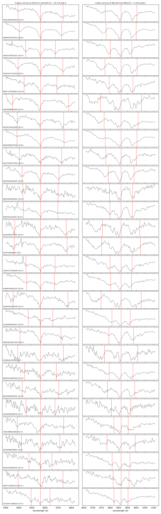

## Carbon lines
Line cross-correlation (C II, C I, H I, He I) for four SDSS-V white dwarfs, Gaussian fits to optical C II lines, HST/COS G130M equivalent widths, and GALEX FUV−NUV colours.

The first figure shows the SDSS-V spectra of Gaia DR3 5208047381438507520 and Gaia DR3 6886051830805052288 (middle two). Above them is an SDSS-V DA of similar colour, and below them is the hot DQ SDSS J234843.30−094245.3 (Dufour et al. 2008). Orange lines mark C II positions; blue dotted lines mark Balmer positions. A three-spectrum version with only 5208047381438507520 is `figures/hot_dq_comparison_5208047381438507520.png`.

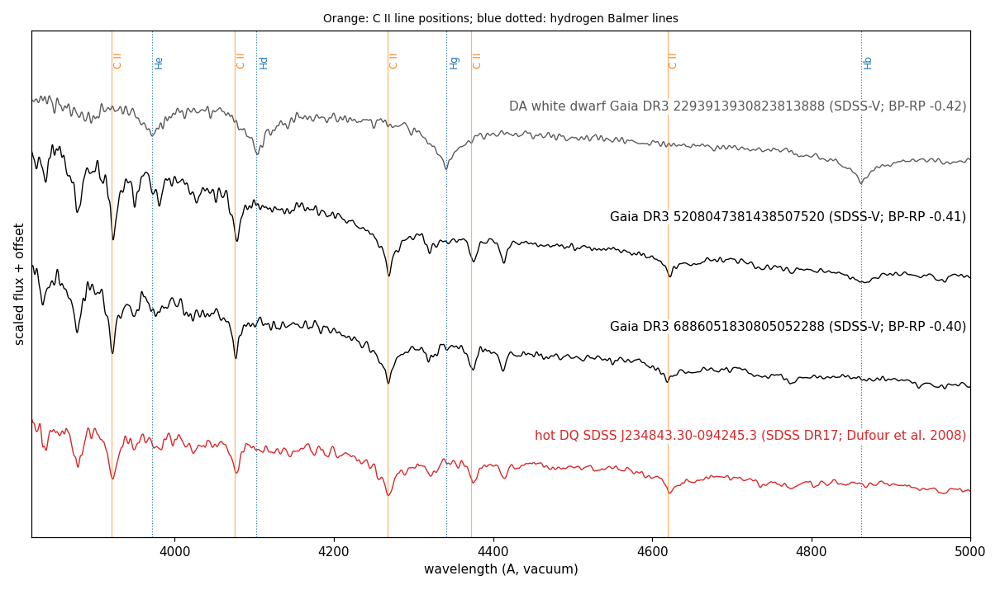

`carbon_screen.csv` lists the results of a matched-filter carbon screen (`carbon_screen.py`) of two samples:
- 3,480 SDSS-V spectra classified DA-type by SnowWhite, selected for high mass or a SnowWhite fit at the log g grid edge (sample 99th percentile of the combined C I + C II contrast: 7.1);
- 3,286 spectra with other SnowWhite classes (DB, DC, DZ, DQ and mixed; 99th percentile 6.65).

The table gives the 34 screened white dwarfs with carbon lines:
- 25 with an existing DQ-type or DAQ classification, or already in this repository;
- 5 with no existing carbon classification. Three are catalogued as DA or unclassified (Gaia DR3 883885440381808000, 4847399905305694080 and 2076678981825545088). Two are catalogued as DC: or DB and show C I lines in both visits (Gaia DR3 6465542891501713408 and 343958710690034944). All five are in the figure below;
- 2 possible detections in low-S/N spectra;
- 2 known carbon white dwarfs that the screen does not detect (contrast 1.7 and 3.2).

The line templates are atomic C I and C II lines, so cool DQ white dwarfs with only C2 Swan bands are not detected: 11 of 261 DQ-labelled spectra pass.

For 883885440381808000, the LAMOST DR10 spectrum of 2011-11-24 gives its highest carbon contrast (4.4) at the SDSS-V velocity of +110 km/s. For 4847399905305694080, GALEX GR6/7 GII photometry gives FUV-NUV = +3.13 ± 0.20, redder than all 741 SDSS-V DAs within 0.06 in BP-RP (maximum +0.72).

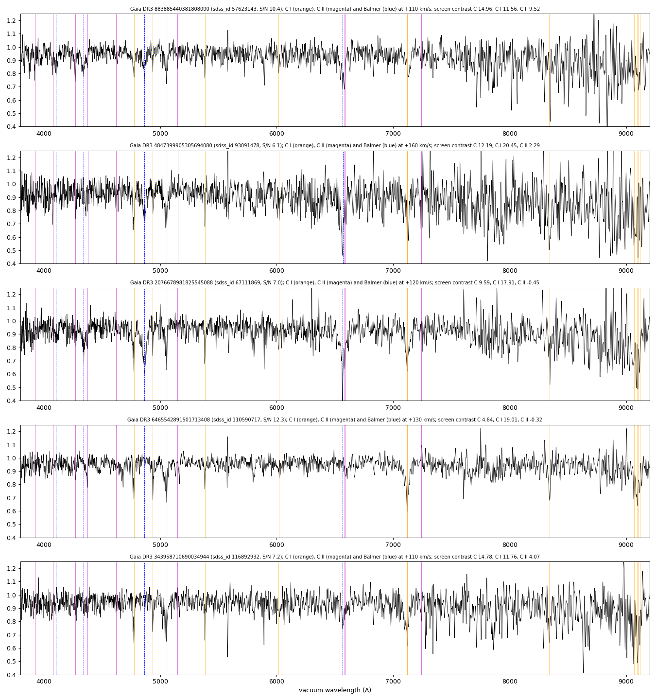
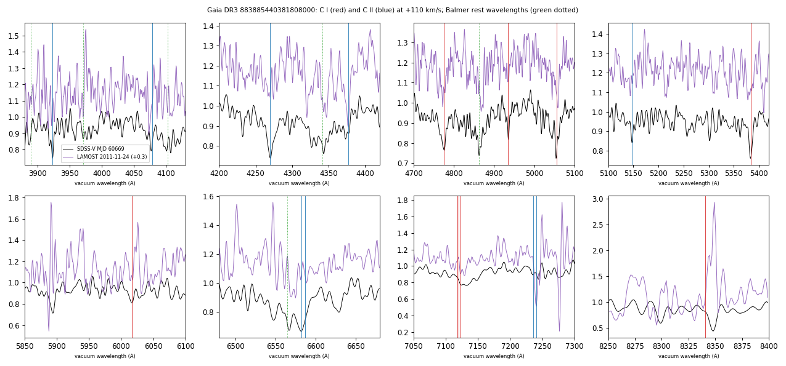
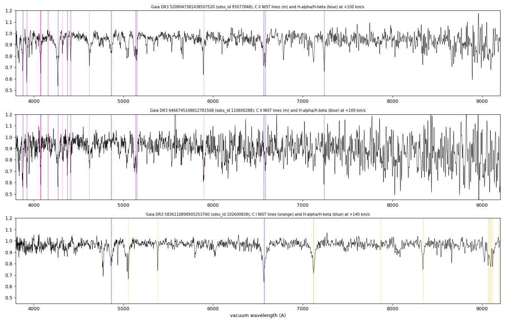
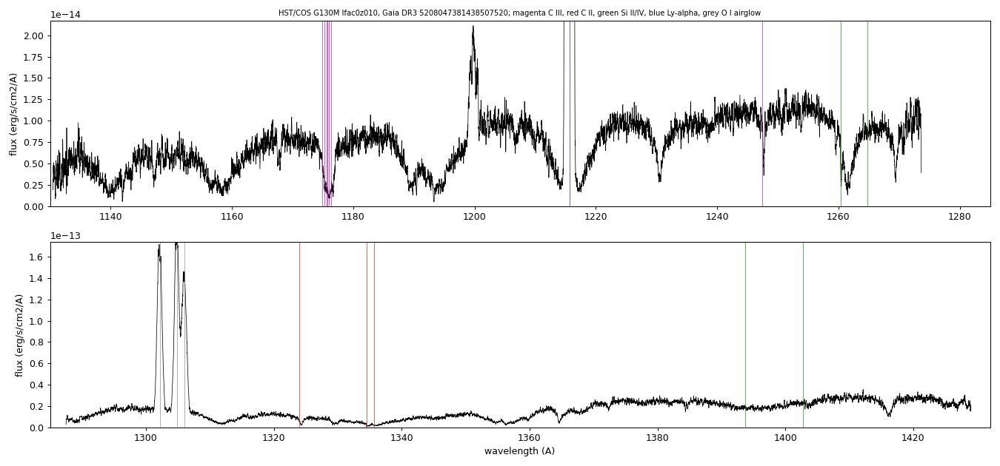
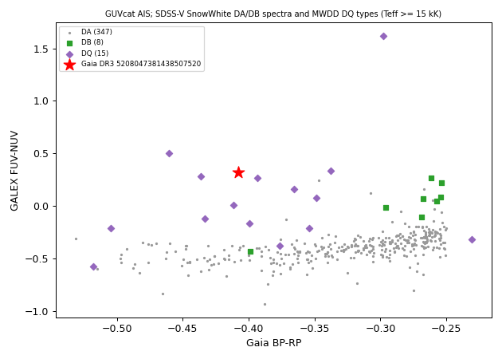

## TESS amplitude spectra
The highest TESS peak per light curve for five SDSS-V white dwarfs, with pixel-level fits to locate the signal.

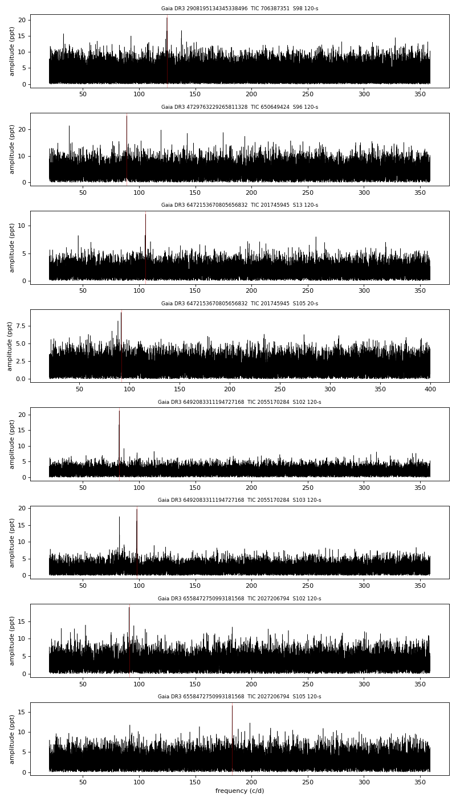

## Eclipse
Eclipse ephemeris of Gaia DR3 4731701084150029824 from ATLAS forced photometry.

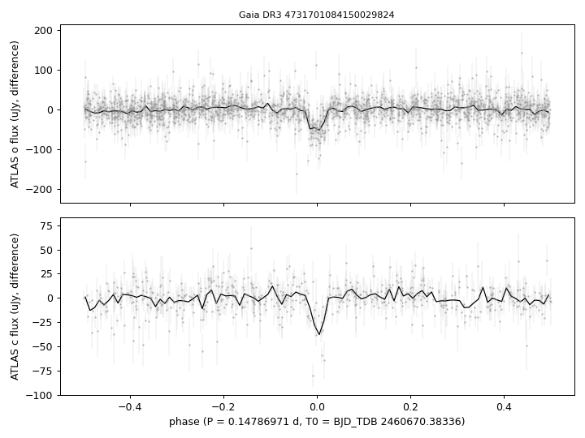

## Balmer emission
H-alpha and H-beta emission equivalent widths and double-peak separations.

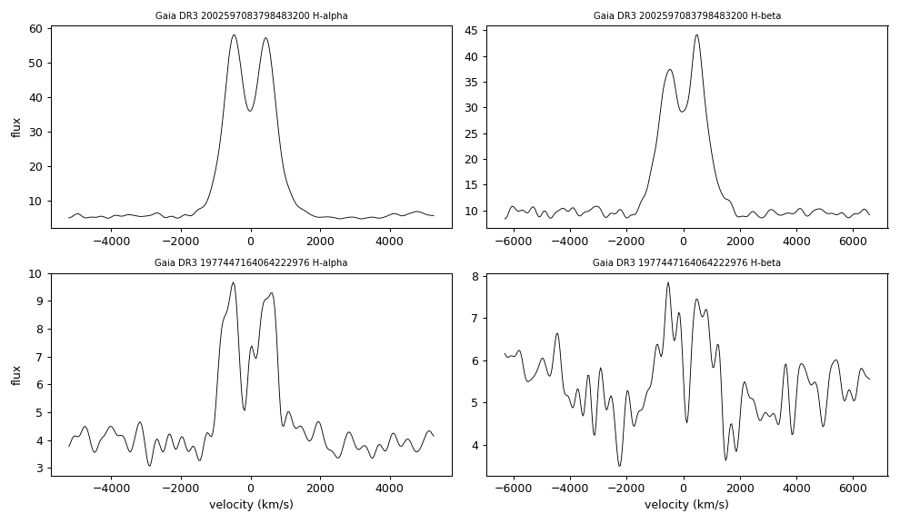

## Photometric periods
Gaia DR3 6021870154194477312 is shown in the first figure:
- top: its SDSS-V spectrum;
- middle: the ATLAS periodogram;
- bottom: ATLAS, Gaia and TESS light curves folded on one frequency.

`periodic_6021870154194477312.csv` also gives fits for the three Gaia sources within 13″.

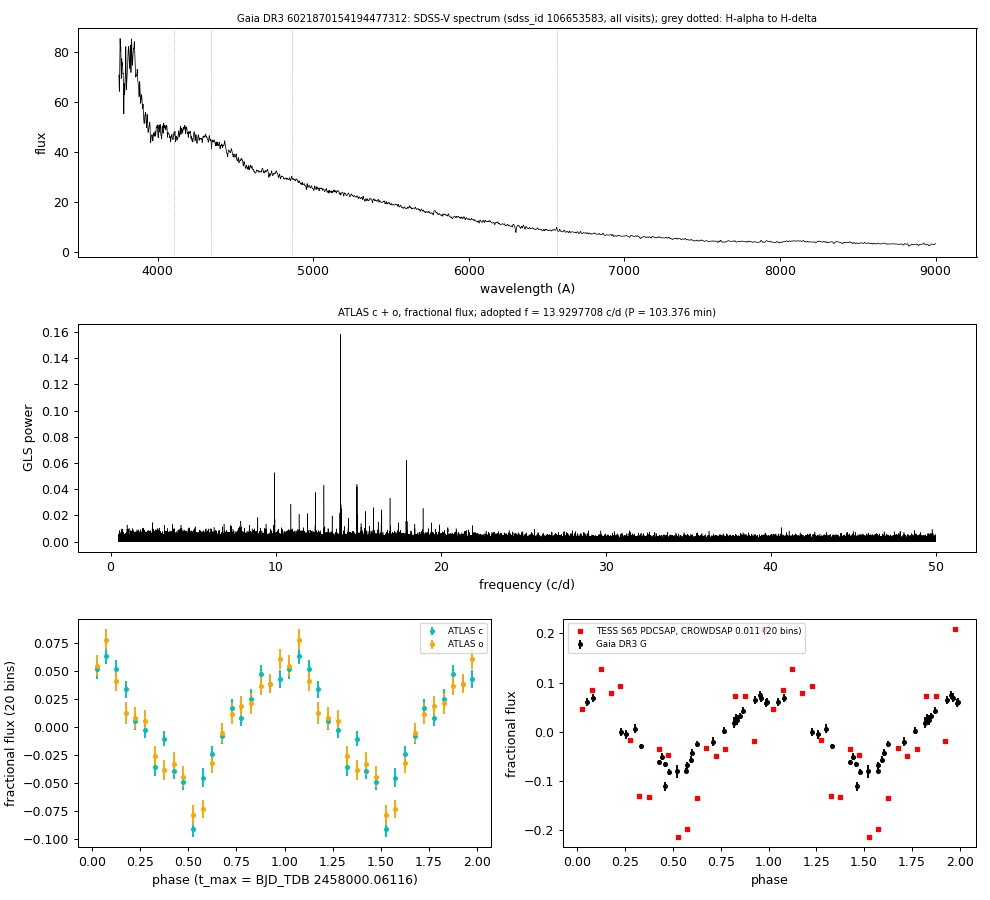

`periodic_white_dwarfs.csv` covers seven white dwarfs selected by their Gaia DR3 GLS frequency. Each frequency was recovered in ATLAS or ZTF, with the Gaia and TESS amplitudes and times of maximum at that frequency.

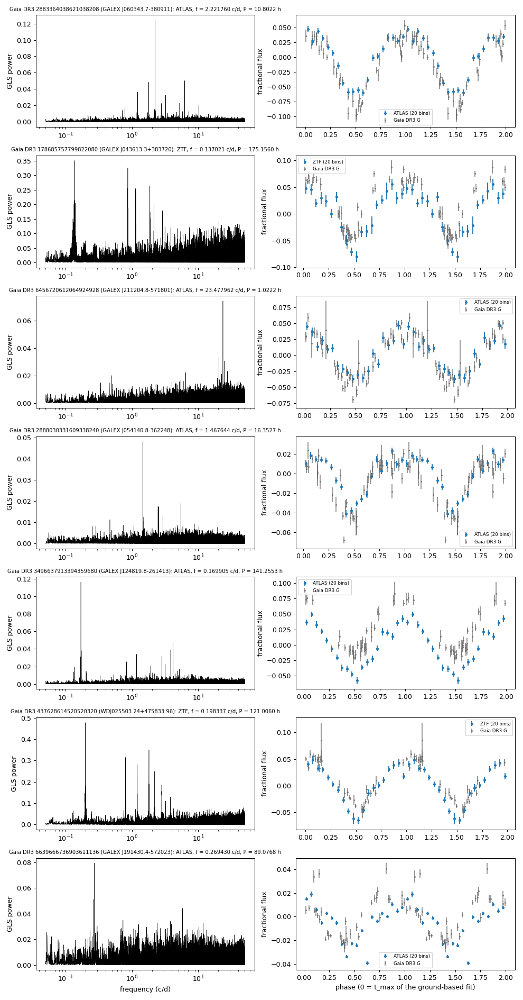

## Reproduction
```
pip install -r requirements.txt
cd scripts
python zeeman_split.py ../data/zeeman_input.csv
python carbon_lines.py 95077848 5208047381438507520
python carbon_lines.py 110600288 6466745168812781568
python carbon_lines.py 102600838 5836110898905253760
python carbon_lines.py 114554634 6886051830805052288
python carbon_lines.py 57623143 883885440381808000
python carbon_lines.py 93091478 4847399905305694080
python carbon_lines.py 67111869 2076678981825545088
python carbon_lines.py 110590717 6465542891501713408
python carbon_lines.py 116892932 343958710690034944
python carbon_screen.py --table
python carbon_screen.py --sample ../tables/carbon_screen_sample.csv   # full 3,480-spectrum screen (about 1 GB of downloads)
python carbon_screen.py --sample-nonda ../tables/carbon_screen_nonda.csv   # 3,286 non-DA spectra
python lamost_compare.py
python cos_lines.py
python galex_colours.py 5208047381438507520
python galex_colours.py 6886051830805052288
python galex_colours.py 4847399905305694080 --window -0.25 0.05 --target-galex 22.858 0.203 19.731 0.019
python tess_periodogram.py 2055170284 102 120
python tess_pixel_test.py 6492083311194727168 2055170284 102 82.34 120
python j0353_eclipse.py
python cv_balmer.py 65701864
python periodic_6021870154194477312.py
python tess_periodogram.py 1251484163 65 120 0.5 50
python periodic_white_dwarfs.py
python figures.py
```
Arguments for the other TESS light curves and pixel tests are in the table columns (TIC, sector, cadence, frequency).

## Data sources
SDSS-V DR20 and SDSS DR17; Gaia DR3 (ESA/Gaia/DPAC), including epoch photometry (VizieR I/355/epphot) and the Gaia Synthetic Photometry Catalogue (VizieR J/A+A/674/A33); TESS SPOC and HST/COS program 17420 (MAST); GALEX GUVcat AIS (Bianchi et al. 2017), GALEX GR6/7 (MAST) and the GALEX CAUSE Kepler catalogue (Olmedo et al. 2015); LAMOST DR10; ATLAS forced photometry (Tonry et al. 2018; Shingles et al. 2021); ZTF public data releases (IRSA); NIST Atomic Spectra Database; Montreal White Dwarf Database; SIMBAD.
