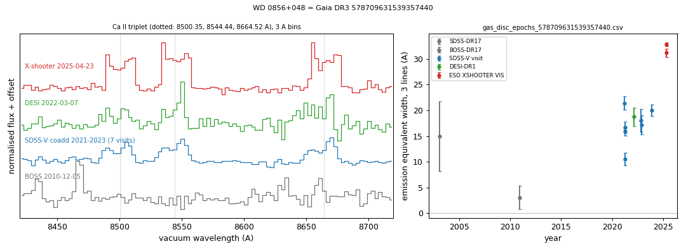
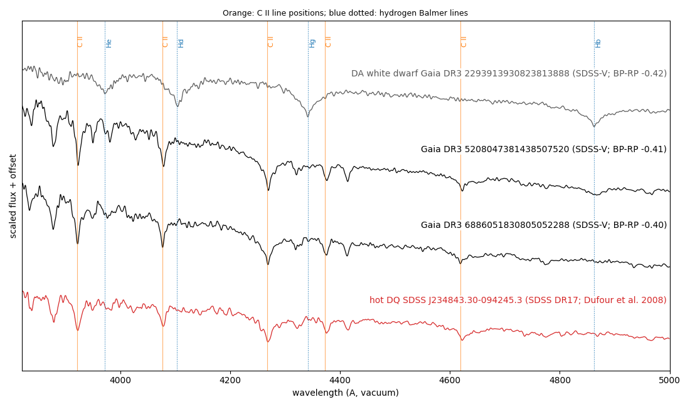
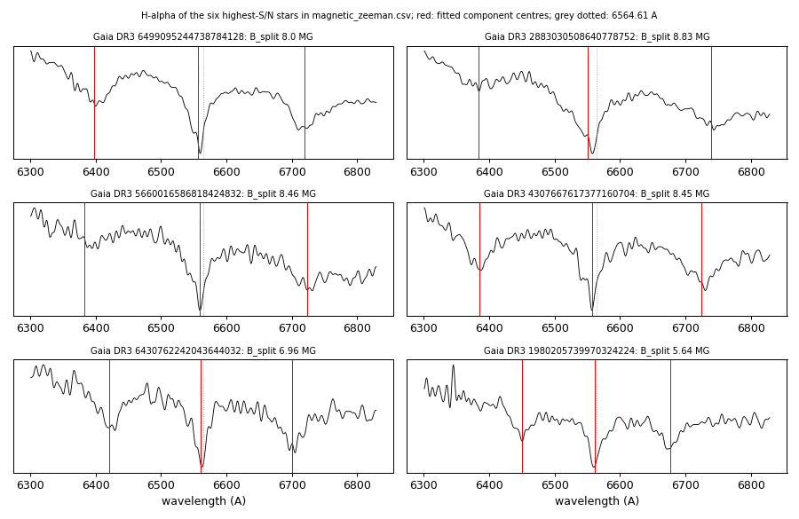

# SDSS-V DR20 white dwarfs: measurements

Measurements of white dwarfs from public SDSS-V DR20 spectra (Astra 0.8.1), with DESI DR1, SDSS/BOSS, ESO X-shooter, TESS, HST/COS, GALEX, ATLAS, ZTF and Gaia DR3 epoch photometry. Each table gives the measured quantities with existing SIMBAD, MWDD (snapshot 2026-08-05) and SDSS-V SnowWhite classifications. The scripts in `scripts/` download the public data and recompute every table and figure. Data were retrieved 2026-09-23 to 2026-09-25. Methods are in [METHODS.md](METHODS.md).

## Topics

| topic | page | tables | objects |
|---|---|---|---|
| Ca II triplet emission (gaseous discs) | [docs/gas_discs.md](docs/gas_discs.md) | `gas_disc_white_dwarfs.csv`, `gas_disc_epochs_*.csv`, `gas_disc_screen.csv`, `desi_gas_disc_screen.csv` | 6 |
| Carbon lines | [docs/carbon.md](docs/carbon.md) | `carbon_white_dwarfs.csv`, `carbon_screen.csv`, `carbon_*_features.csv` | 9 |
| Zeeman splitting | [docs/zeeman.md](docs/zeeman.md) | `magnetic_zeeman.csv` | 30 |
| Photometric periods | [docs/periodic.md](docs/periodic.md) | `periodic_6021870154194477312.csv`, `periodic_white_dwarfs.csv`, `reflection_3107374277060584064*.csv`, `tess_ffi_*.csv` | 16 |
| TESS amplitude spectra | [docs/zz_ceti.md](docs/zz_ceti.md) | `zz_ceti_objects.csv`, `zz_ceti_tess_sectors.csv` | 5 |
| Eclipse and Balmer emission | [docs/eclipse_and_emission.md](docs/eclipse_and_emission.md) | `eclipsing_4731701084150029824.csv`, `balmer_emission.csv` | 3 |

## Selected objects

| object | measurement | page |
|---|---|---|
| WD 0856+048 (Gaia DR3 578709631539357440) | Double-peaked Ca II triplet emission in 7 SDSS-V visits (2021-2023), DESI (2022) and X-shooter (2025); equivalent width 3.1 ± 2.3 Å in BOSS (2010), 17.6 ± 0.5 Å in SDSS-V, 32.9 ± 0.4 Å in X-shooter | [gas discs](docs/gas_discs.md) |
| WD J1959+2208 (Gaia DR3 1827014701883095680) | Double-peaked Ca II triplet emission in both SDSS-V visits (2024); catalogued DB | [gas discs](docs/gas_discs.md) |
| GALEX J0039−0356 (Gaia DR3 2527617665632689024) | Single-peaked Ca II triplet emission in 4 SDSS-V visits, no Balmer emission; WISE W1/W2 7× and 16× the Rayleigh-Jeans photosphere | [gas discs](docs/gas_discs.md) |
| SDSS J2054+1610 (Gaia DR3 1764314497240770176) | Ca II triplet, O I 7774 and O I 8446 emission, no Balmer emission; first spectrum of this white-dwarf candidate | [gas discs](docs/gas_discs.md) |
| WDJ1448+3225 (Gaia DR3 1283510882895711872) | Double-peaked Ca II triplet emission in BOSS (2010) and DESI (2021, 2022); catalogued DBA | [gas discs](docs/gas_discs.md) |
| Gaia DR3 5208047381438507520 | C II lines in SDSS-V and C II/C III in HST/COS; catalogued DA | [carbon](docs/carbon.md) |
| Gaia DR3 6886051830805052288 | C II lines in both SDSS-V visits; catalogued DA | [carbon](docs/carbon.md) |
| Five further SDSS-V white dwarfs | C I and/or C II lines; catalogued DA, DB, DC: or unclassified | [carbon](docs/carbon.md) |
| Gaia DR3 1980205739970324224 | Zeeman-split H-alpha and H-beta (5.6 MG); listed as a ZZ Ceti (P = 1286 s) in Vincent et al. 2020 | [Zeeman](docs/zeeman.md) |
| Gaia DR3 6021870154194477312 | 103.4-min period in ATLAS, Gaia DR3 and TESS | [periods](docs/periodic.md) |
| Gaia DR3 3107374277060584064 | P = 14.229 h in CoRoT (2007-2012), Gaia DR3 and ZTF, larger in r than g; H-alpha, H-beta and Ca II emission whose velocity follows the photometric phase | [periods](docs/periodic.md) |
| Gaia DR3 3890059941364406144 (SDSS J102251.62+161151.6) | 87.3-min period in Gaia DR3, ZTF and TESS; semi-amplitude 1.8% (g), 4.6% (r) | [periods](docs/periodic.md) |
| Gaia DR3 4731701084150029824 | Eclipses with P = 3.549 h in ATLAS | [eclipse](docs/eclipse_and_emission.md) |



 

## Layout
- `tables/`: measurement tables (CSV).
- `figures/<topic>/`: one figure per object or per comparison.
- `docs/`: one page per topic.
- `data/`: inputs (ATLAS and ZTF photometry, Gaia epoch photometry, object lists); `data/cache/` holds downloads and is not tracked.
- `scripts/`: measurement and figure scripts.

## Reproduction
```
pip install -r requirements.txt
cd scripts
python zeeman_split.py ../data/zeeman_input.csv
python carbon_lines.py 95077848 5208047381438507520
python carbon_lines.py 110600288 6466745168812781568
python carbon_lines.py 102600838 5836110898905253760
python carbon_lines.py 114554634 6886051830805052288
python carbon_lines.py 57623143 883885440381808000
python carbon_lines.py 93091478 4847399905305694080
python carbon_lines.py 67111869 2076678981825545088
python carbon_lines.py 110590717 6465542891501713408
python carbon_lines.py 116892932 343958710690034944
python carbon_screen.py --table
python carbon_screen.py --sample ../tables/carbon_screen_sample.csv   # full 3,480-spectrum screen (about 1 GB of downloads)
python carbon_screen.py --sample-nonda ../tables/carbon_screen_nonda.csv   # 3,286 non-DA spectra
python lamost_compare.py
python cos_lines.py
python galex_colours.py 5208047381438507520
python galex_colours.py 6886051830805052288
python galex_colours.py 4847399905305694080 --window -0.25 0.05 --target-galex 22.858 0.203 19.731 0.019
python tess_periodogram.py 2055170284 102 120
python tess_pixel_test.py 6492083311194727168 2055170284 102 82.34 120
python j0353_eclipse.py
python cv_balmer.py 65701864
python periodic_6021870154194477312.py
python tess_periodogram.py 1251484163 65 120 0.5 50
python periodic_white_dwarfs.py
python reflection_3107374277060584064.py
python tess_ffi_photometry.py 3890059941364406144 155.7148994 16.1977169 16.488695 18.034 45 46 72
python gas_disc_screen.py --sample   # about 51,000 visit files, downloaded and deleted one by one; keeps about 1.5 GB
python gas_disc_screen.py --pass2 ../data/cache/gas_disc_pass2.csv
python gas_disc_screen.py --table ../data/cache/gas_disc_pass2.csv
python gas_disc_epochs.py 578709631539357440 55774610 134.841202 4.636784
python gas_disc_epochs.py 1827014701883095680 63867520 299.804316 22.147851
python gas_disc_epochs.py 2527617665632689024 70254122 9.892213 -3.946573
python gas_disc_epochs.py 1764314497240770176 63203321 313.742432 16.179092
python desi_gas_disc_screen.py --sample   # 44,417 DESI DR1 spectra via SPARCL; keeps about 0.5 GB
python desi_gas_disc_screen.py --pass2 ../data/cache/desi_gas_pass2.csv
python desi_gas_disc_screen.py --table ../data/cache/desi_gas_pass2.csv
python gas_disc_epochs.py 1283510882895711872 - 222.081216 32.416845
python gas_disc_epochs.py 1379988076130545536 60943632 242.822993 40.284241
python wise_excess.py 2527617665632689024 9.892213 -3.946573
python wise_excess.py 578709631539357440 134.841202 4.636784
python ztf_lightcurve.py 578709631539357440 134.841202 4.636784
python ztf_lightcurve.py 1827014701883095680 299.804316 22.147851
python ztf_lightcurve.py 2527617665632689024 9.892213 -3.946573
python ztf_lightcurve.py 1764314497240770176 313.742432 16.179092
python figures.py            # all figures; or name one, e.g. python figures.py gas_discs
```
Arguments for the other TESS light curves and pixel tests are in the table columns (TIC, sector, cadence, frequency).

## Data sources
SDSS-V DR20 and SDSS DR17 (including BOSS); DESI DR1 via SPARCL (NOIRLab Astro Data Lab) and the DESI DR1 white-dwarf catalogues (Swan et al. 2026; Amorim et al. 2026); ESO X-shooter phase 3 spectra (programme 115.28GM.001); Legacy Surveys DR10 (Astro Data Lab); Gaia DR3 (ESA/Gaia/DPAC), including epoch photometry (VizieR I/355/epphot), the Gaia Synthetic Photometry Catalogue (VizieR J/A+A/674/A33) and Gentile Fusillo et al. (2021, VizieR J/MNRAS/508/3877); TESS SPOC light curves and full-frame images (TESScut), and HST/COS program 17420 (MAST); CoRoT faint-star light curves (CDS, B/corot); GALEX GUVcat AIS (Bianchi et al. 2017), GALEX GR6/7 (MAST) and the GALEX CAUSE Kepler catalogue (Olmedo et al. 2015); LAMOST DR10; ATLAS forced photometry (Tonry et al. 2018; Shingles et al. 2021); ZTF public data releases (IRSA); NIST Atomic Spectra Database; Montreal White Dwarf Database; SIMBAD.
