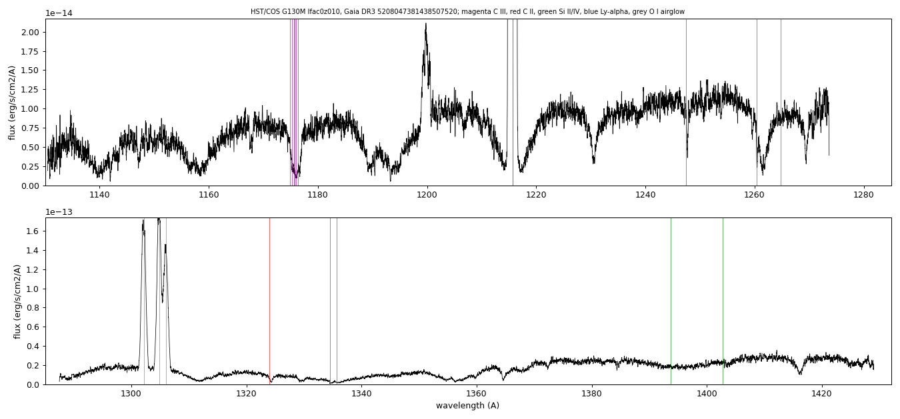
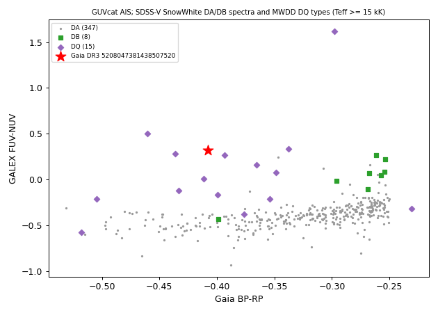
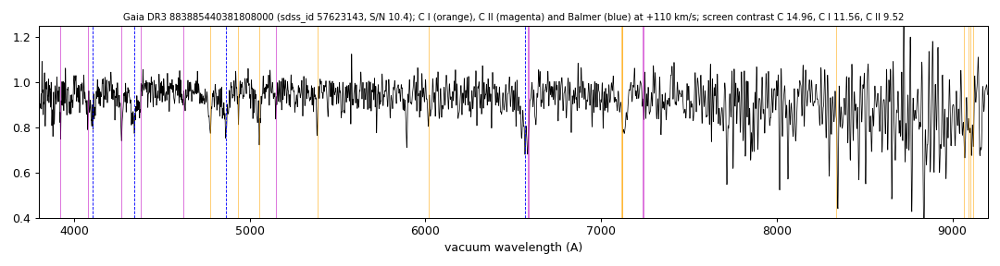
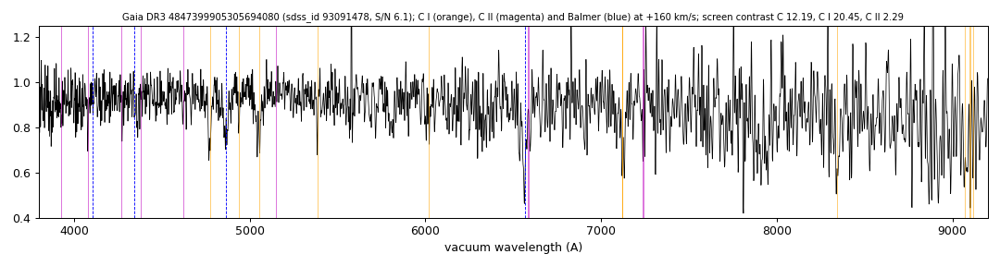
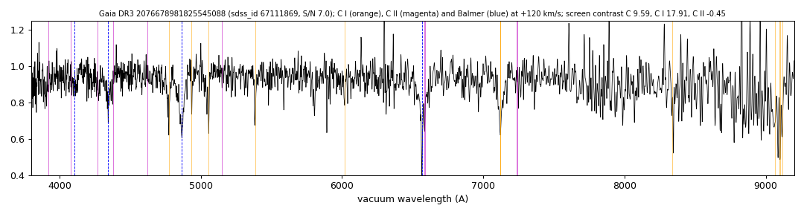
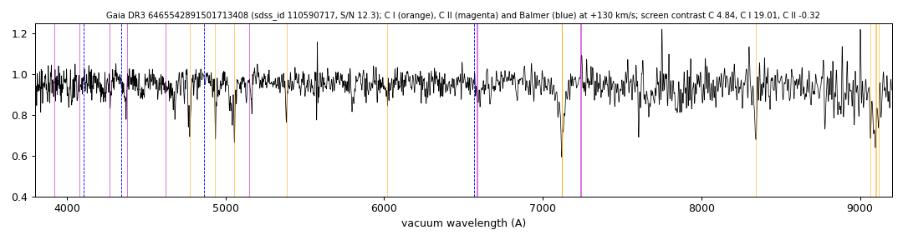
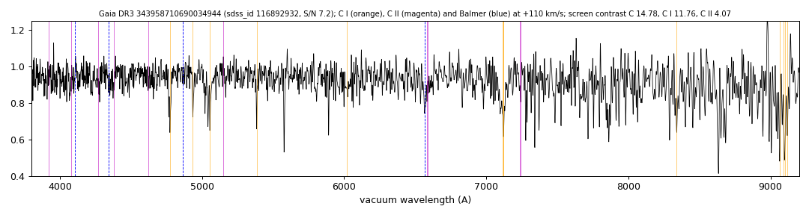
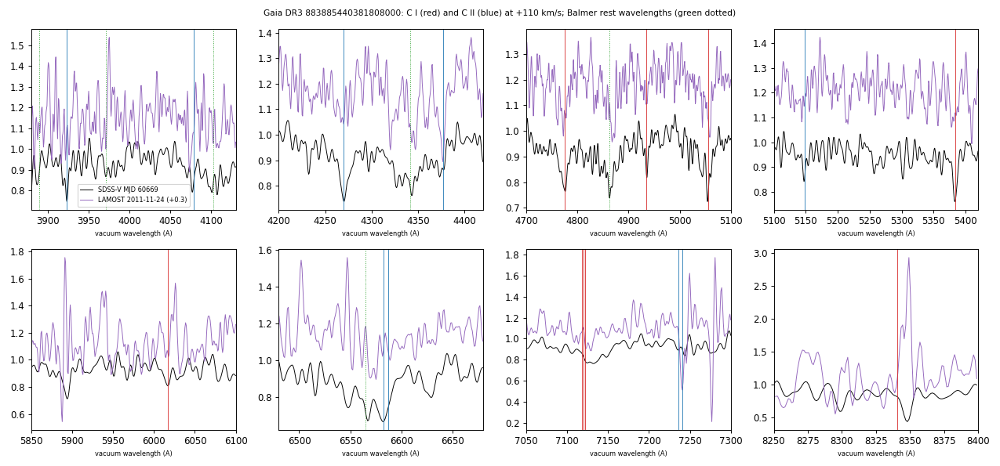

# Carbon lines

Tables:
- `carbon_white_dwarfs.csv`: nine SDSS-V white dwarfs with line cross-correlation contrasts (C II, C I, H I, He I), screen contrasts, GALEX photometry and existing classifications;
- `carbon_screen.csv`: the carbon screen results for 34 white dwarfs (below);
- `carbon_5208047381438507520_optical_CII_features.csv`, `carbon_6886051830805052288_optical_CII_features.csv`: Gaussian fits to optical C II lines;
- `carbon_5208047381438507520_cos_features.csv`: HST/COS G130M equivalent widths.

Methods are in [METHODS.md](../METHODS.md#methods).

## Hot DQ comparison
SDSS-V spectra of Gaia DR3 5208047381438507520 and Gaia DR3 6886051830805052288 (middle two). Above them is an SDSS-V DA of similar colour; below them is the hot DQ SDSS J234843.30−094245.3 (Dufour et al. 2008). Orange lines mark C II positions; blue dotted lines mark Balmer positions. A three-spectrum version with only 5208047381438507520 is [hot_dq_comparison_5208047381438507520.png](../figures/carbon/hot_dq_comparison_5208047381438507520.png).

HST/COS G130M spectrum of Gaia DR3 5208047381438507520:

GALEX FUV−NUV against Gaia BP−RP:

Optical spectra with NIST line positions: [5208047381438507520](../figures/carbon/5208047381438507520_lines.png), [6466745168812781568](../figures/carbon/6466745168812781568_lines.png), [5836110898905253760](../figures/carbon/5836110898905253760_lines.png).

## Carbon screen
`carbon_screen.csv` lists the results of a matched-filter carbon screen (`carbon_screen.py`) of two samples:
- 3,480 SDSS-V spectra classified DA-type by SnowWhite, selected for high mass or a SnowWhite fit at the log g grid edge (sample 99th percentile of the combined C I + C II contrast: 7.1);
- 3,286 spectra with other SnowWhite classes (DB, DC, DZ, DQ and mixed; 99th percentile 6.65).

The table gives the 34 screened white dwarfs with carbon lines:
- 25 with an existing DQ-type or DAQ classification, or already in this repository;
- 5 with no existing carbon classification. Three are catalogued as DA or unclassified (Gaia DR3 883885440381808000, 4847399905305694080 and 2076678981825545088). Two are catalogued as DC: or DB and show C I lines in both visits (Gaia DR3 6465542891501713408 and 343958710690034944);
- 2 possible detections in low-S/N spectra;
- 2 known carbon white dwarfs that the screen does not detect (contrast 1.7 and 3.2).

The line templates are atomic C I and C II lines, so cool DQ white dwarfs with only C2 Swan bands are not detected: 11 of 261 DQ-labelled spectra pass.

For 883885440381808000, the LAMOST DR10 spectrum of 2011-11-24 gives its highest carbon contrast (4.4) at the SDSS-V velocity of +110 km/s. For 4847399905305694080, GALEX GR6/7 GII photometry gives FUV−NUV = +3.13 ± 0.20, redder than all 741 SDSS-V DAs within 0.06 in BP−RP (maximum +0.72).

SDSS-V coadds of the five, with C I (orange), C II (magenta) and Balmer (blue dashed) positions at the screen velocity:

LAMOST DR10 spectrum of 883885440381808000:

