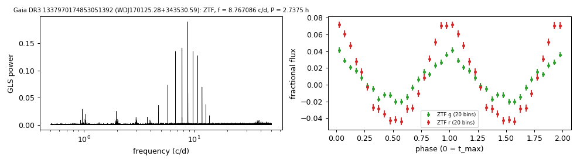
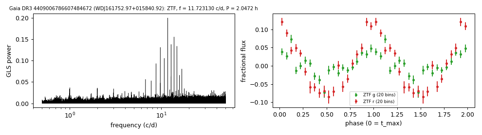
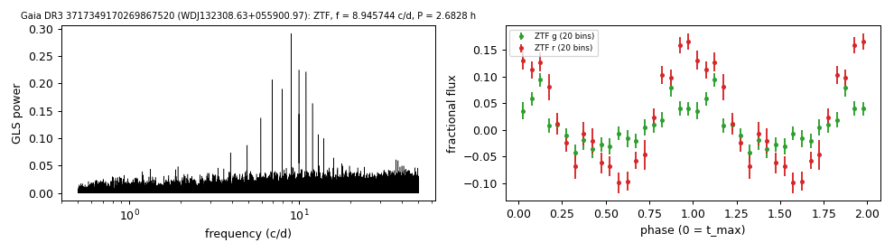
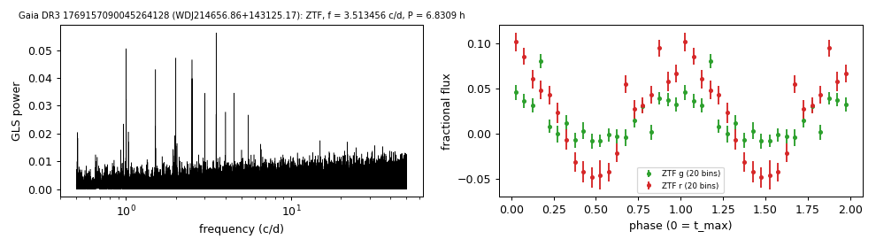
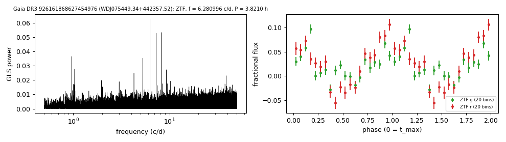

# Photometric periods of DA white dwarfs with emission lines

`tables/dae_wd_periods.csv` lists seven white dwarfs from the DESI DR1 classes DAe, DAE and DA+ (Amorim et al. 2026) with ZTF periods of 2.0 to 6.8 hours. In each, the semi-amplitude is larger in r than in g, and the CatWISE2020 W1 and W2 magnitudes are 1.7 to 2.9 magnitudes brighter than the white-dwarf model prediction. The method is in [METHODS.md](../METHODS.md#methods).

| star | Gaia DR3 | G | distance (pc) | DESI class | GF21 Teff, mass (H) | W1, W2 excess (mag) | P (h) | semi-amplitude g, r |
|---|---|---|---|---|---|---|---|---|
| WDJ172406.13+562003.08 | 1420761029600606592 | 16.26 | 403 | DAe | 15.0 kK, 0.11 Msun | 1.8, 1.9 | 5.9917 | 3.3%, 8.2% |
| WDJ170125.28+343530.59 | 1337970174853051392 | 18.94 | 741 | DAE | 12.1 kK, 0.17 Msun | 2.0, 1.7 | 2.7375 | 2.6%, 5.8% |
| WDJ161752.97+015840.92 | 4409006786607484672 | 18.95 | 1233 | DAE | 22.4 kK, 0.24 Msun | 2.1, 2.6 | 2.0472 | 3.4%, 8.8% |
| WDJ132308.63+055900.97 | 3717349170269867520 | 18.99 | 955 | DAe | 22.8 kK, 0.34 Msun | 1.9, 2.0 | 2.6828 | 4.5%, 11.8% |
| WDJ214656.86+143125.17 | 1769157090045264128 | 19.45 | 1010 | DAE | 16.0 kK, 0.24 Msun | 1.9, 1.6 | 6.8309 | 2.6%, 6.4% |
| WDJ083531.69+315503.31 | 709815329316284928 | 19.26 | 742 | DAE | 13.2 kK, 0.25 Msun | 2.1, 2.4 | 4.4240 | 2.3%, 8.9% |
| WDJ075449.34+442357.52 | 926161868627454976 | 19.40 | 1449 | DAe | 18.9 kK, 0.21 Msun | 2.2, 2.9 | 3.8211 | 2.8%, 5.7% |

- **DESI class:** Amorim et al. (2026), DESI DR1.
- **GF21 Teff, mass:** Gentile Fusillo et al. (2021) H-atmosphere fits to the combined photometry; with a companion contributing red flux they are indicative only.
- **W1, W2 excess:** how much brighter the observed CatWISE2020 magnitude is than the pure-H Montreal model prediction scaled to Gaia G.
- No period for any of these stars in VSX, the MWDD, Chen et al. (2020), Oliveira da Rosa et al. (2024) or the catalogues listed on the [hot-white-dwarf page](hot_wd_periods.md).
- WDJ172406.13+562003.08 is listed in VSX as type CV without a period.

