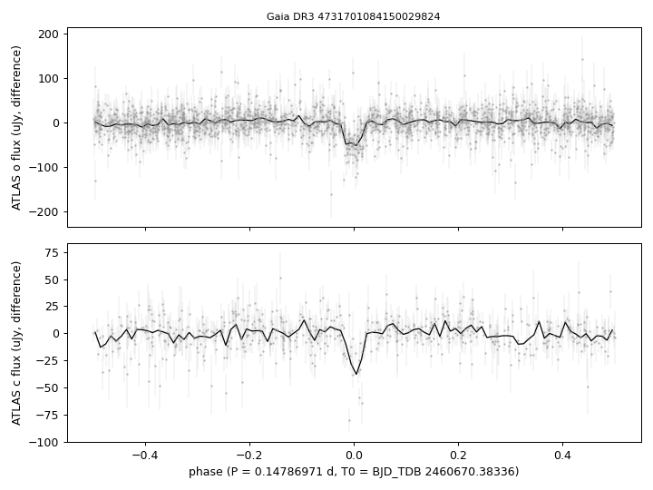
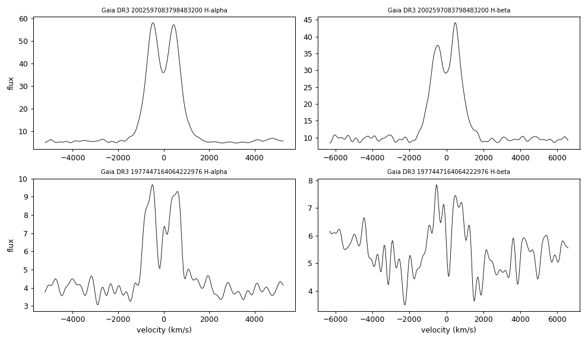

# Eclipse and Balmer emission

## Eclipse
`tables/eclipsing_4731701084150029824.csv`: eclipse ephemeris of Gaia DR3 4731701084150029824 from ATLAS forced photometry (method in [METHODS.md](../METHODS.md#methods)).

## Balmer emission
`tables/balmer_emission.csv`: H-alpha and H-beta emission equivalent widths and double-peak separations of two SDSS-V spectra.

