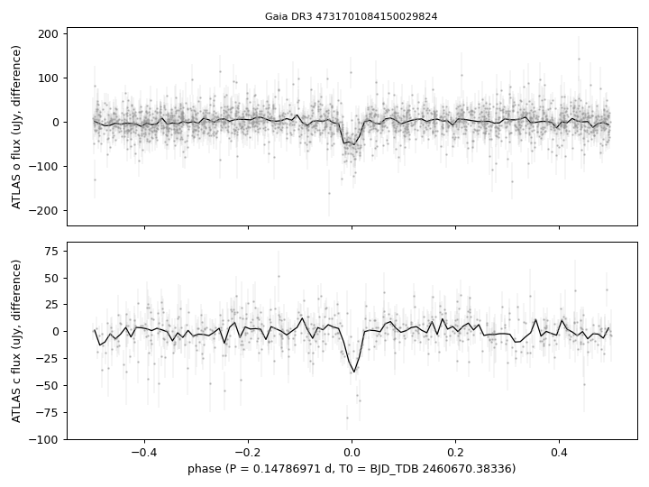
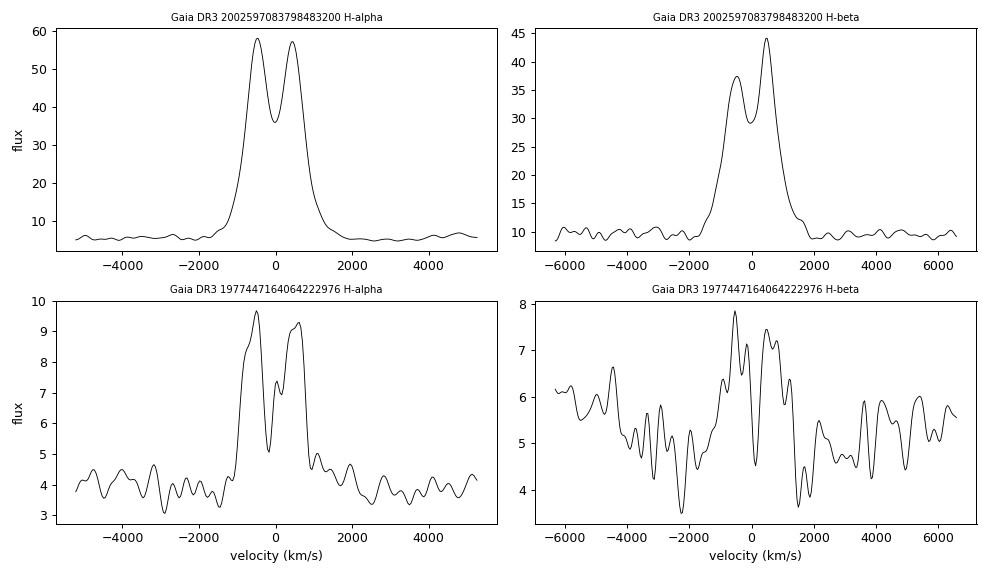

# Eclipse and Balmer emission

## Eclipse
`tables/eclipsing_4731701084150029824.csv`: eclipse ephemeris of Gaia DR3 4731701084150029824 from ATLAS forced photometry (method in [METHODS.md](../METHODS.md#methods)). The star has the colours and luminosity of a mid-M dwarf (BP-RP 2.82, parallax 9.10 mas, M_G 13.2), not of a white dwarf; the eclipses remove about a third of its light for 10.6 min every 3.55 h, consistent with a compact companion being totally eclipsed, but the eclipsed object is not identified.

## Balmer emission
`tables/balmer_emission.csv`: H-alpha and H-beta emission equivalent widths and double-peak separations of two SDSS-V spectra.

