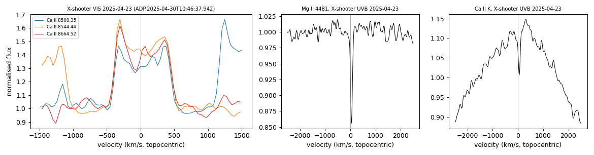
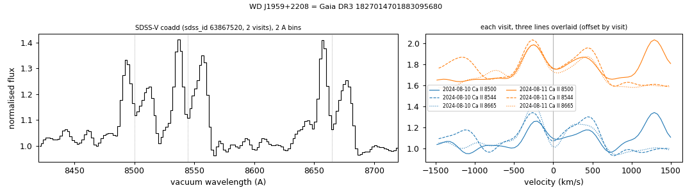

# Ca II triplet emission (gaseous debris discs)

Tables:
- `gas_disc_white_dwarfs.csv`: two white dwarfs with double-peaked Ca II triplet emission (8500, 8544, 8665 Å) in every SDSS-V visit and no existing emission classification in SIMBAD, MWDD, the DESI DR1 white-dwarf catalogues (Swan et al. 2026; Amorim et al. 2026), VizieR, the gaseous-disc lists of Saker et al. (2025) and Ma et al. (2025), or ADS full text;
- `gas_disc_epochs_578709631539357440.csv`, `gas_disc_epochs_1827014701883095680.csv`: the Ca II emission equivalent width and profile scale in every available spectrum;
- `gas_disc_screen.csv`: screen output for the two stars, the known gaseous-disc white dwarfs with SDSS-V spectra and the DESI EDR emission candidates of Ma et al. (2025) with SDSS-V spectra.

Methods are in [METHODS.md](../METHODS.md#methods).

## WD 0856+048 (Gaia DR3 578709631539357440)
G = 18.34, parallax 3.82 ± 0.19 mas; catalogued DA (SIMBAD, MWDD, SnowWhite, DESI DR1). The Ca II triplet shows double-peaked emission in all seven SDSS-V visits (2021-03-19 to 2023-11-22; z per visit 9 to 22), in the DESI spectrum of 2022-03-07 and in both ESO X-shooter spectra of 2025-04-23. The emission equivalent width (three lines) is 17.6 ± 0.5 Å in the SDSS-V coadd (visits 10.5-21.4 Å), 18.7 ± 1.8 Å (DESI 2022), 31.2 ± 0.8 and 32.9 ± 0.4 Å (X-shooter 2025) and 3.1 ± 2.3 Å in the BOSS spectrum of 2010-12-05. The SDSS spectrum of 2003-01-31 gives 15.0 ± 6.8 Å. In X-shooter the profile peaks are at about −310 and +360 km/s, and the UVB arm shows Mg II 4481 and Ca II K absorption.

Left: the Ca II triplet in the BOSS, SDSS-V, DESI and X-shooter spectra (3 Å bins). Right: equivalent width against date.

X-shooter 2025-04-23: the three Ca II lines in velocity (left), Mg II 4481 and Ca II K (right).

ZTF (69 r-band points, 2019-2026; `ztf_lightcurve.py`): seasonal medians within 5% of each other (errors 1-3%); no significant period between 0.02 and 300 c/d.

## WD J1959+2208 (Gaia DR3 1827014701883095680)
G = 16.78, parallax 5.73 ± 0.07 mas; catalogued DB (SIMBAD, MWDD) and DBA/DB (SnowWhite). Both SDSS-V visits (2024-08-10 and 2024-08-11) show double-peaked Ca II emission, with peaks at about −260 and +430 km/s in the coadd. The equivalent width is 17.8 ± 0.5 Å and 26.6 ± 0.5 Å in the two visits. No other spectrum was found in SPARCL (SDSS, BOSS, DESI) or the ESO archive.

ZTF (about 4,000 g, r and i points, 2018-2026; `ztf_lightcurve.py`): rms 1.4-2.8% against errors of 1.3-1.9%. Three nights of high-cadence data (2018-08-13, 2018-08-14 and a 6.5-hour 30-s sequence on 2024-07-05) have no 10-minute bin more than 2.5% below the median. The highest peaks of the combined periodogram are at 1, 2 and 3 c/d (daily sampling); no peak is shared by all data sets.

## Screen
`gas_disc_screen.py` screens the SDSS-V visit spectra of all 50,960 objects with a SnowWhite classification. The CaT region of each spectrum is divided by the median of its 100 nearest neighbours in the Gaia colour-magnitude diagram, and the residual is matched-filtered with single- and double-peaked emission templates. On the white-dwarf locus (parallax/error > 3, M_G > 8.5), the 99th and 99.9th percentiles of z_cat are 8.8 and 19.1 for DA-type spectra (30,090) and 14.7 and 27.6 for other white-dwarf classes (2,702). MS and CV classes, whose companions or accretion discs show Ca II emission, have higher values (99.9th percentiles 38 and 78).

Validation (`gas_disc_screen.csv`): of the eight known gaseous-disc white dwarfs with Ca II emission that have SDSS-V spectra, six have z_cat between 11.6 and 81.9 (WD 0842+572, SDSS J0738+1835, WD J1930−5028, WD J0529−3401, WD J1829+4537 and WD J2307−0002). SDSS J0234−0406 (z_cat 2.4) and WD 1622+587 (2.0; S/N 4.7) are not recovered. WD J0914+1914, whose disc shows H, O and S but no Ca II emission, has z_cat 3.9. The seven DESI EDR emission candidates of Ma et al. (2025) with SDSS-V spectra have z_cat 0.6 to 3.3.
