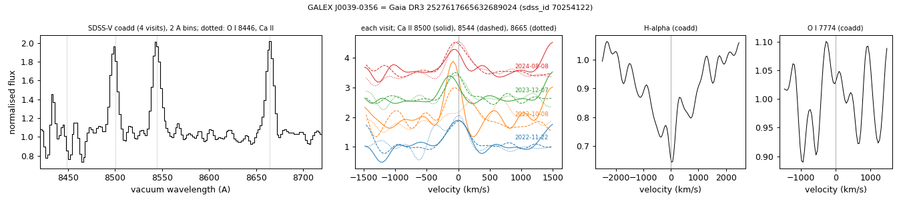
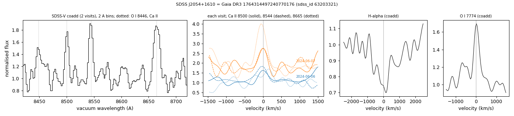
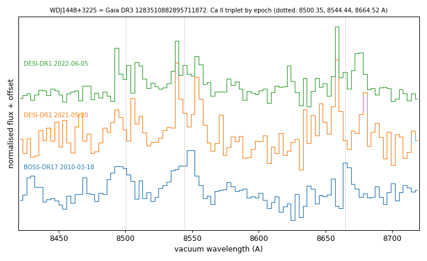
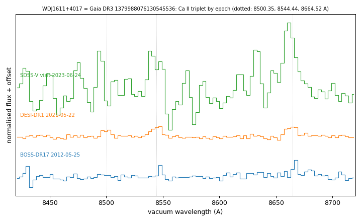

# Ca II triplet emission (gaseous debris discs)

Tables:
- `gas_disc_white_dwarfs.csv`: six white dwarfs with Ca II triplet emission (8500, 8544, 8665 Å) and no existing emission classification: four from the SDSS-V screen (two with double-peaked and two with single-peaked profiles) and two from the DESI DR1 screen (one tentative) in SIMBAD, MWDD, the DESI DR1 white-dwarf catalogues (Swan et al. 2026; Amorim et al. 2026), VizieR, the gaseous-disc lists of Saker et al. (2025) and Ma et al. (2025), or ADS full text;
- `gas_disc_epochs_<gaia_dr3>.csv`: the Ca II emission equivalent width, profile scale and Gaussian centroid and width in every available spectrum;
- `desi_gas_disc_screen.csv`: DESI DR1 screen output for the two DESI stars and the known Ca II emitters in DESI DR1;
- `gas_disc_screen.csv`: SDSS-V screen output for the four SDSS-V stars, the known gaseous-disc white dwarfs with SDSS-V spectra and the DESI EDR emission candidates of Ma et al. (2025) with SDSS-V spectra.

Methods are in [METHODS.md](../METHODS.md#methods).

## WD 0856+048 (Gaia DR3 578709631539357440)
G = 18.34, parallax 3.82 ± 0.19 mas; catalogued DA (SIMBAD, MWDD, SnowWhite, DESI DR1). The Ca II triplet shows double-peaked emission in all seven SDSS-V visits (2021-03-19 to 2023-11-22; z per visit 9 to 22), in the DESI spectrum of 2022-03-07 and in both ESO X-shooter spectra of 2025-04-23. The emission equivalent width (three lines) is 17.6 ± 0.5 Å in the SDSS-V coadd (visits 10.5-21.4 Å), 18.7 ± 1.8 Å (DESI 2022), 31.2 ± 0.8 and 32.9 ± 0.4 Å (X-shooter 2025) and 3.1 ± 2.3 Å in the BOSS spectrum of 2010-12-05. The SDSS spectrum of 2003-01-31 gives 15.0 ± 6.8 Å. In X-shooter the profile peaks are at about −310 and +360 km/s, and the UVB arm shows Mg II 4481 and Ca II K absorption.

Left: the Ca II triplet in the BOSS, SDSS-V, DESI and X-shooter spectra (3 Å bins). Right: equivalent width against date.

X-shooter 2025-04-23: the three Ca II lines in velocity (left), Mg II 4481 and Ca II K (right).

ZTF (69 r-band points, 2019-2026; `ztf_lightcurve.py`): seasonal medians within 5% of each other (errors 1-3%); no significant period between 0.02 and 300 c/d.

## WD J1959+2208 (Gaia DR3 1827014701883095680)
G = 16.78, parallax 5.73 ± 0.07 mas; catalogued DB (SIMBAD, MWDD) and DBA/DB (SnowWhite). Both SDSS-V visits (2024-08-10 and 2024-08-11) show double-peaked Ca II emission, with peaks at about −260 and +430 km/s in the coadd. The equivalent width is 17.8 ± 0.5 Å and 26.6 ± 0.5 Å in the two visits. No other spectrum was found in SPARCL (SDSS, BOSS, DESI) or the ESO archive.

ZTF (about 4,000 g, r and i points, 2018-2026; `ztf_lightcurve.py`): rms 1.4-2.8% against errors of 1.3-1.9%. Three nights of high-cadence data (2018-08-13, 2018-08-14 and a 6.5-hour 30-s sequence on 2024-07-05) have no 10-minute bin more than 2.5% below the median. The highest peaks of the combined periodogram are at 1, 2 and 3 c/d (daily sampling); no peak is shared by all data sets.

## GALEX J0039−0356 (Gaia DR3 2527617665632689024)
G = 18.91, parallax 2.54 ± 0.25 mas; catalogued DA (SIMBAD, MWDD, SnowWhite; SnowWhite Teff 22,800 K, log g 8.15). All four SDSS-V visits (2022-11-22 to 2024-08-08) show single-peaked Ca II triplet emission. The equivalent width is 34.4 ± 1.1 Å in the coadd and 23-49 Å in the visits; the Gaussian FWHM is 340 km/s (not corrected for the instrumental resolution) and the centroid moves between −17 and −70 km/s. H-alpha and H-beta show no emission. No other spectrum was found in SPARCL or the ESO archive.

Legacy Surveys DR10 forced WISE photometry (`wise_excess.py`) gives W1 = 7.65 ± 0.54 and W2 = 9.03 ± 1.23 nanomaggies, 7.3 and 16.3 times the Rayleigh-Jeans extrapolation of the z-band flux (excess 12σ in W1 and 7σ in W2). Two galaxies (Legacy Surveys type REX) lie 6.4″ and 7.1″ away, with W1 fluxes of 3.4 and 9.7 nanomaggies; the Tractor fit separates them (fracflux_w1 = 0.47). ZTF (about 840 points, 2018-2026) shows no dips and no significant period.

## SDSS J2054+1610 (Gaia DR3 1764314497240770176)
G = 18.41, parallax 2.11 ± 0.16 mas; listed as a photometric white-dwarf candidate (SIMBAD WD?), with no earlier spectrum. The SDSS-V spectrum (two visits, 2024-06-06 and 2024-06-07) is a DA (SnowWhite Teff 27,500 K, log g 8.06) with single-peaked emission in the Ca II triplet (equivalent width 24 ± 3 Å, FWHM 265 km/s), O I 8446 and O I 7774, and no H-alpha or H-beta emission. The star is outside the Legacy Surveys DR10 footprint and not detected in CatWISE2020. ZTF (about 1,900 points) shows no significant period; its faint outliers are mostly at airmass 1.9-2.4 or in shallow images.

## WDJ1448+3225 (Gaia DR3 1283510882895711872; DESI DR1 screen)
G = 19.38, parallax 1.96 ± 0.26 mas; catalogued DBA (SIMBAD, MWDD, DESI DR1; DESI Teff 19,800 K, log g 8.32). Not in the SDSS-V SnowWhite table. The Ca II triplet shows double-peaked emission in the BOSS spectrum of 2010-03-18 and in both DESI spectra (2021-05-20 and 2022-06-05), with equivalent widths of 19.2 ± 3.8, 37.4 ± 3.7 and 23.5 ± 2.5 Å. H-alpha shows no emission. Legacy Surveys DR10 WISE photometry is dominated by a neighbour.

## WDJ1611+4017 (Gaia DR3 1379988076130545536; DESI DR1 screen; tentative)
G = 17.75, parallax 3.20 ± 0.08 mas; catalogued DA (DESI Teff 16,600 K, log g 7.55). The DESI spectrum of 2021-05-22 shows weak Ca II triplet emission (equivalent width 5.9 ± 0.4 Å; screen z_cat 16.8); the BOSS spectrum of 2012-05-25 gives 3.5 ± 1.1 Å. The single SDSS-V visit (2023-06-24) has S/N 2.6 in this region. The Legacy Surveys WISE fluxes exceed the Rayleigh-Jeans extrapolation (4× in W1, 6× in W2) but the source is blended (fracflux_w1 = 2.1).

## DESI DR1 screen
`desi_gas_disc_screen.py` applies the same method to the 44,301 usable DESI DR1 spectra of the white dwarfs in the Amorim et al. (2026) class file (retrieved with SPARCL), with neighbours from the colours and absolute magnitudes in that file. The 99.9th percentiles of z_cat are 14.3 (DA-type), 12.5 (other white-dwarf classes), 38 (classes with an M-dwarf companion) and 104 (CVs). The known emitters give z_cat 39.7 (WD J1829+4537), 14.7 (WD J2307−0002), 12.3 (WD 0856+048) and 9.2 (WD J0857−2245). Of 46 spectra with z_cat > 8 and consistent lines, 23 have a DESI DR1 class of WD+MS, CV or STAR, and four DA with narrow Ca II and H-alpha emission are 1-2 magnitudes brighter than single white dwarfs of their colour.

## SDSS-V screen
`gas_disc_screen.py` screens the SDSS-V visit spectra of all 50,960 objects with a SnowWhite classification. The CaT region of each spectrum is divided by the median of its 100 nearest neighbours in the Gaia colour-magnitude diagram, and the residual is matched-filtered with single- and double-peaked emission templates. On the white-dwarf locus (parallax/error > 3, M_G > 8.5), the 99th and 99.9th percentiles of z_cat are 8.8 and 19.1 for DA-type spectra (30,090) and 14.7 and 27.6 for other white-dwarf classes (2,702). MS and CV classes, whose companions or accretion discs show Ca II emission, have higher values (99.9th percentiles 38 and 78).

Validation (`gas_disc_screen.csv`): of the eight known gaseous-disc white dwarfs with Ca II emission that have SDSS-V spectra, six have z_cat between 11.6 and 81.9 (WD 0842+572, SDSS J0738+1835, WD J1930−5028, WD J0529−3401, WD J1829+4537 and WD J2307−0002). SDSS J0234−0406 (z_cat 2.4) and WD 1622+587 (2.0; S/N 4.7) are not recovered. WD J0914+1914, whose disc shows H, O and S but no Ca II emission, has z_cat 3.9. The seven DESI EDR emission candidates of Ma et al. (2025) with SDSS-V spectra have z_cat 0.6 to 3.3.
