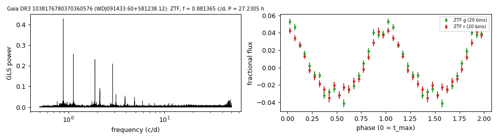
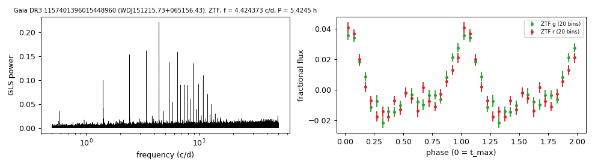
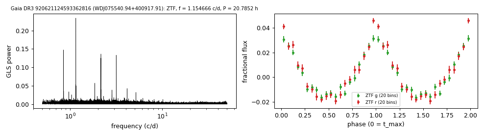
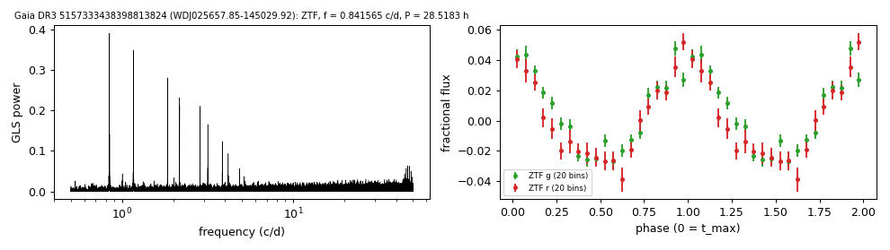
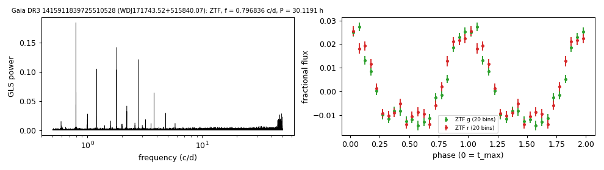

# Day-scale photometric periods of hot white dwarfs

`tables/hot_wd_periods.csv` lists nine white dwarfs, most with helium-dominated spectra hotter than 50,000 K, with photometric periods of 5.4 to 30.1 hours. Seven come from a blind Lomb-Scargle search of the ZTF light curves of the 716 white dwarfs that Jestin et al. (2026) list as not variable; two come from Gaia DR3 periodogram frequencies confirmed with ATLAS forced photometry. For two of the nine (WDJ151215.73+065156.43 and KUV 07523+4017) the period was already published by Reindl et al. (2021); the other seven have no published period. The method is in [METHODS.md](../METHODS.md#methods).

Checks applied to every star: VSX, the Montreal White Dwarf Database, Chen et al. (2020), Gao et al. (2025), Wang et al. (2025), Oliveira da Rosa et al. (2024), Filiz et al. (2026), Reindl et al. (2021) and the TESS cataclysmic-variable catalogue (2026); TARS excludes these stars by its magnitude and distance cuts.

| star | Gaia DR3 | G | distance (pc) | spectral information | P (h) | semi-amplitude |
|---|---|---|---|---|---|---|
| WDJ091433.60+581238.12 | 1038176780370360576 | 17.73 | 810 | SBSS 0910+584; spectral type DO (MWDD) | 27.2305 | ZTF g 4.0%, r 3.4% |
| WDJ151215.73+065156.43 | 1157401396015448960 | 17.22 | 990 | GALEX J151215.7+065156; UHE white dwarf, DOZ (Reindl et al. 2021); period published there: 0.226022 d | 5.4245 | ZTF g 1.9%, r 1.8% |
| WDJ221519.86+253059.05 | 1879989790567353344 | 17.05 | 1190 | GALEX J221519.8+253059; spectral type DOZ (MWDD) | 18.5400 | ZTF g 2.3%, r 2.1%; Gaia G 2.9% |
| WDJ075540.94+400917.91 | 920621124593362816 | 17.80 | 1052 | KUV 07523+4017; DOZ / PG 1159 (Reindl et al. 2021); period published there: 0.866092 d | 20.7852 | ZTF g 2.2%, r 2.7% |
| WDJ065819.86+441438.40 | 953685015492787456 | 17.53 | 483 | Gaia XP class DO (Vincent et al. 2024) | 14.7448 | ZTF g 3.5%, r 2.8% |
| WDJ025657.85-145029.92 | 5157333438398813824 | 17.37 | 1072 | spectral type DA with a photometric temperature above 100 kK (MWDD) | 28.5183 | ZTF g 3.4%, r 3.5% |
| WDJ171743.52+515840.07 | 1415911839725510528 | 17.59 | 833 | spectral type DA, 68.0 kK (Kilic et al. 2026, via the MWDD) | 30.1191 | ZTF g 1.9%, r 1.9% |
| WDJ234931.84-353916.52 | 2311285729210966144 | 17.88 | 882 | GALEX J234931.8-353916; SDSS-V DR20 SnowWhite class DA | 26.4793 | ATLAS c+o 2.6%; Gaia G 3.6% |
| WDJ065134.01+185201.09 | 3365371721281530880 | 18.10 | 1100 | no spectrum found | 20.1718 | ATLAS c+o 3.6%; Gaia G 5.2% |

- **Distance:** 1/parallax.
- Jestin et al. (2026) list the seven ZTF stars as not variable (their table A1); the periodograms above give false-alarm probabilities of 1e-63 to 1e-252.
- The periods of WDJ151215.73+065156.43 and KUV 07523+4017 are in the period tables of Reindl et al. (2021, A&A 647, A184); those tables are not in VizieR and were matched by name after the first version of this page.
- WDJ234931.84-353916.52 and WDJ065134.01+185201.09 carry Gaia DR3 `vari_spurious_signals` frequencies; ATLAS shows the same frequency as the highest peak in both bands.
- Related objects already on the [periods page](periodic.md): WDJ043832.74+003117.01 (DO, 26.09 h), WDJ080026.64+633414.85 (DOA, 21.42 h), Gaia DR3 6170660401283991680 (DO, 27.01 h).

