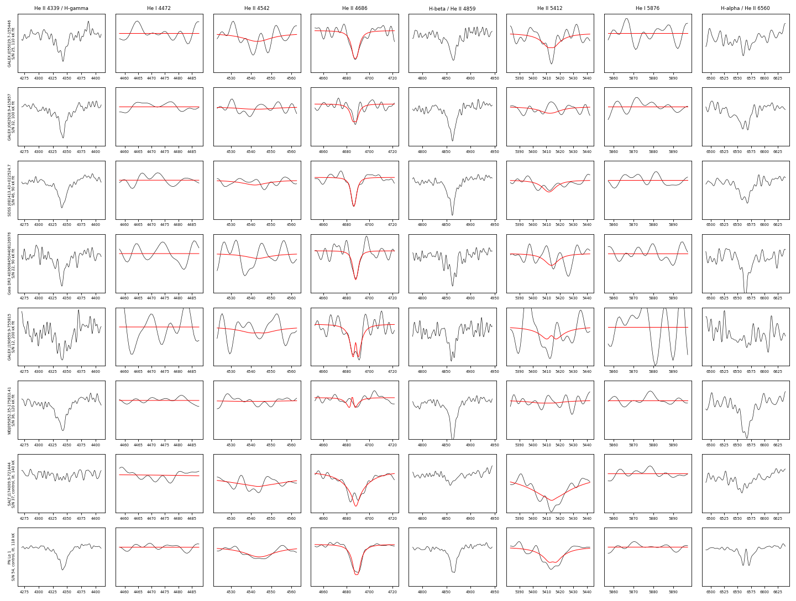
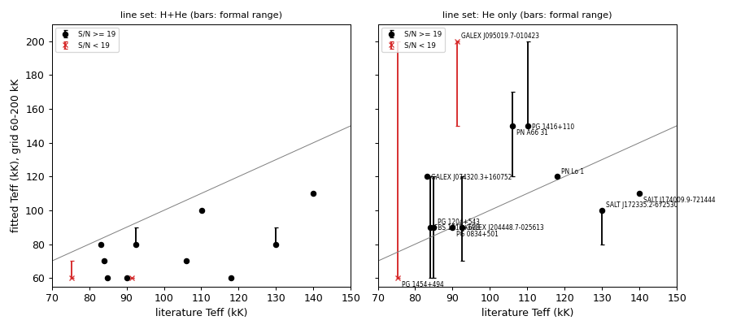

# Hot white dwarfs with He II lines

`tables/hot_white_dwarfs.csv` gives effective temperatures from fits of TMAP H+He NLTE model spectra to SDSS-V DR20 coadds. There is one row per star and line set: "H+He" uses Balmer, He I and He II lines; "He only" uses He I and He II lines. The stars and literature values are in `data/hot_white_dwarfs_sources.csv`, and the method is in [METHODS.md](../METHODS.md#methods).

## Six DAO white dwarfs
These six SDSS-V white dwarfs show He II 4686 absorption together with Balmer lines. No earlier spectrum or spectroscopic classification was found for any of them. Sources checked on 2026-09-26:
- SIMBAD references;
- MWDD;
- a VizieR 3″ all-catalogue cone;
- SDSS DR17 (including BOSS) and DESI DR1 spectra via SPARCL;
- ADS full text under the Gaia, GALEX, WDJ and short names.

| star | Gaia DR3 | sdss_id | G | M_G | S/N | SnowWhite | Teff, He only (kK) | note |
|---|---|---|---|---|---|---|---|---|
| GALEX J055029.7−155446 | 2995107164834343680 | 73346836 | 17.39 | 6.84 | 25 | DA | 110 (100-120) | |
| GALEX J062928.9−415857 | 5570041179495992704 | 99327334 | 17.25 | 6.61 | 32 | DA | 100 | |
| SDSS J081413.43+022524.7 | 3090786872841030016 | 74510696 | 17.11 | 6.01 | 46 | DA | 90 | DA white-dwarf candidate from photometry (Girven et al. 2011) |
| Gaia DR3 4036084504408126976 | 4036084504408126976 | 80998734 | 17.14 | 6.82 | 22 | DA | 90 | |
| GALEX J190659.9−755815 | 6365804611201098368 | 109787602 | 17.80 | 6.79 | 12 | DA/DAO | not constrained | S/N 12; the controls at S/N ≤ 15 are not reproduced |
| WDJ095852.35−175833.41 | 5671975077144346112 | 100568930 | 17.17 | 6.71 | 36 | DA | not constrained | He II 4686 depth about 3%; the fitted velocity is at the grid edge. Photometric period 3.27 d (Ranaivomanana et al. 2025; Jestin et al. 2026) |

- M_G is not corrected for extinction.
- Ranges in brackets are the formal fit ranges.
- The model grid spans 60-200 kK in steps of 10-30 kK.
- The fit uncertainty is better judged from the controls (next section): about 30-40%.

Rows 1-6 are the six stars. Rows 7-8 are the controls SALT J174009.9−721444 (O(He), 140 kK) and PN Lo 1 (118 kK). Black is the SDSS-V coadd; red is the best "He only" model in the fitted windows.

## Controls
The controls are 12 SDSS-V stars with published temperatures (`data/hot_white_dwarfs_sources.csv`).

| line set | controls with S/N ≥ 19 | median fit / literature | 16-84% |
|---|---|---|---|
| He only | 10 | 1.04 | 0.87-1.39 |
| H+He | 10 | 0.75 | 0.64-0.89 |

- The largest deviation among the ten "He only" fits is a factor of 1.44 (GALEX J074320.3+160752).
- Neither control with S/N ≤ 15 is reproduced. GALEX J095019.7−010423 (S/N 10) comes out at 200 kK against 91 kK in the literature; PG 1454+494 (S/N 15) is not constrained.
- The Balmer lines give systematically lower temperatures with H+He-only models (the Balmer-line problem of hot white dwarfs). The "H+He" fits of most controls are at the 60 kK grid edge.
- The hottest control is SALT J174009.9−721444, an O(He) star at 140 ± 15 kK (Jeffery et al. 2023). Its "He only" fit gives 110 kK.

