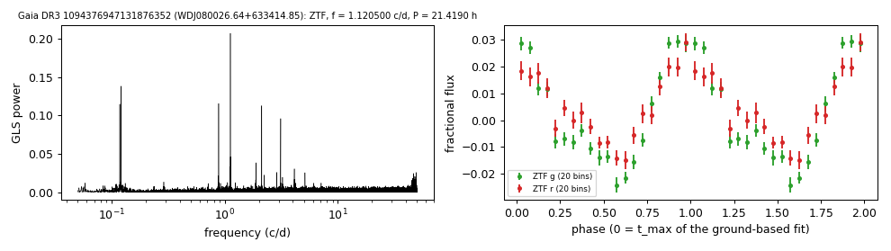

# WDJ080026.64+633414.85 (Gaia DR3 1094376947131876352)

## Photometric periods

DESI DR1 class DOA, Teff 78.2 kK (Swan et al. 2026); Kilic et al. (2026) classify it DO with Teff 98.6 kK.

**Measurement.** P = 21.41901 ± 0.00014 h (ZTF, n = 3391, BJD 2458202.761-2460968.991); semi-amplitude 2.1% ± 0.1%.

| data set | n | semi-amplitude | first harmonic |
|---|---|---|---|
| ZTF | 3391 | 2.10% ± 0.07% | 0.74% |
| ZTF zg | 1511 | 2.38% ± 0.09% | 0.86% |
| ZTF zr | 1880 | 1.63% ± 0.10% | 0.51% |

Method and context: [periodic](../periodic.md)

Tables: [periodic_white_dwarfs.csv](../../tables/periodic_white_dwarfs.csv). Scripts: `scripts/periodic_white_dwarfs.py` (commands in the [reproduction list](../../README.md#reproduction)).

## Input data

- [data/ztf_1094376947131876352.csv](../../data/ztf_1094376947131876352.csv)

## Figures

