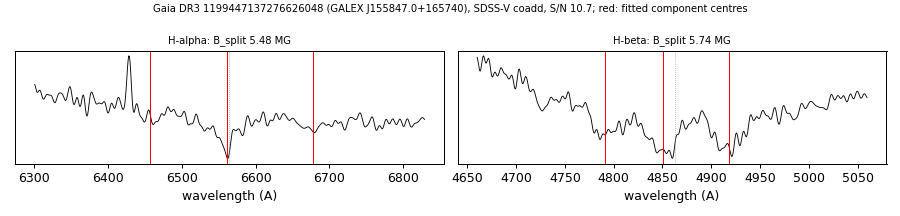

# GALEX J155847.0+165740 (Gaia DR3 1199447137276626048)

## Zeeman splitting

DA white dwarf, G = 18.283; catalogued: SnowWhite DAH; SIMBAD WD*/DA; MWDD DA.

**Measurement.** Zeeman-split Balmer lines: B = 5.48 ± 0.17 MG (H-alpha), 5.74 ± 0.05 MG (H-beta); spectrum S/N 10.7.

Method and context: [zeeman](../zeeman.md)

Tables: [magnetic_zeeman.csv](../../tables/magnetic_zeeman.csv). Scripts: `scripts/zeeman_split.py` (commands in the [reproduction list](../../README.md#reproduction)).

## Figures

