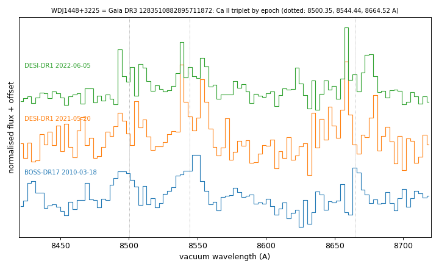

# WDJ1448+3225 (Gaia DR3 1283510882895711872)

## Ca II triplet emission (gaseous discs)

White dwarf, G = 19.383; catalogued: SIMBAD WD*/DBA; MWDD DBA; DESI DR1 DBA.

**Measurement.** Ca II triplet emission (double-peaked); other spectra: BOSS 2010-03-18, DESI 2021-05-20 and 2022-06-05 (EW 19.2 +- 3.8, 37.4 +- 3.7, 23.5 +- 2.5 A); gas_disc_epochs_1283510882895711872.csv.

Method and context: [gas_discs](../gas_discs.md)

Tables: [gas_disc_white_dwarfs.csv](../../tables/gas_disc_white_dwarfs.csv), [gas_disc_epochs_1283510882895711872.csv](../../tables/gas_disc_epochs_1283510882895711872.csv). Scripts: `scripts/gas_disc_epochs.py` (commands in the [reproduction list](../../README.md#reproduction)).

## Figures

