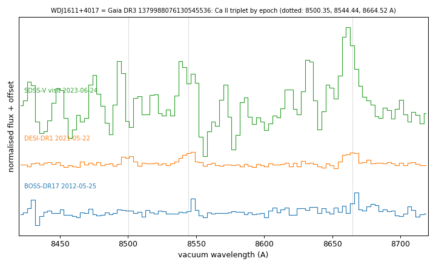

# WDJ1611+4017 (tentative) (Gaia DR3 1379988076130545536)

## Ca II triplet emission (gaseous discs)

White dwarf, G = 17.753; catalogued: SnowWhite DA; SIMBAD WD*/DA; MWDD DA; DESI DR1 DA.

**Measurement.** Ca II triplet emission (single-peaked or blended); other spectra: BOSS 2012-05-25 (EW 3.5 +- 1.1 A), DESI 2021-05-22 (5.9 +- 0.4 A), SDSS-V 2023-06-24 (39 +- 7 A, low S/N); gas_disc_epochs_1379988076130545536.csv.

Method and context: [gas_discs](../gas_discs.md)

Tables: [gas_disc_white_dwarfs.csv](../../tables/gas_disc_white_dwarfs.csv), [gas_disc_epochs_1379988076130545536.csv](../../tables/gas_disc_epochs_1379988076130545536.csv). Scripts: `scripts/gas_disc_epochs.py` (commands in the [reproduction list](../../README.md#reproduction)).

## Figures

