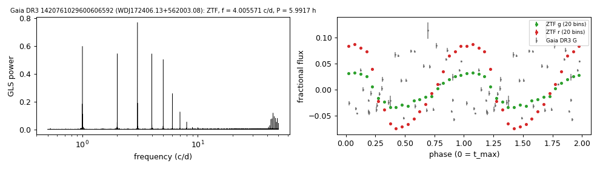

# WDJ172406.13+562003.08 (Gaia DR3 1420761029600606592)

## Periods of DA white dwarfs with emission lines

DESI DR1 class DAe; GF21 15.0 kK, 0.11 Msun; W1, W2 excess 1.8, 1.9 mag. G = 16.26, 403 pc. SDSS J1724+5620, post-common-envelope binary with the orbital period published by Rebassa-Mansergas et al. (2008). Spectroscopic fit 34,733 K, log g 7.22, 0.36 Msun (Bédard et al. 2020).

**Measurement.** P = 7.99238 ± 5e-05 h (ZTF, n = 4034, BJD 2458198.928-2460969.662); semi-amplitude 6.5% ± 0.1%.

| data set | n | semi-amplitude | first harmonic |
|---|---|---|---|
| ZTF | 4034 | 6.53% ± 0.07% | 0.58% |
| ZTF zg | 1986 | 3.85% ± 0.05% | 0.33% |
| ZTF zr | 2048 | 9.16% ± 0.06% | 0.91% |
| Gaia DR3 epoch photometry G | 39 | 6.01% ± 0.19% | - |

Method and context: [dae_wd_periods](../dae_wd_periods.md)

Tables: [dae_wd_periods.csv](../../tables/dae_wd_periods.csv). Scripts: `scripts/hot_dae_wd_periods.py` (commands in the [reproduction list](../../README.md#reproduction)).

## Input data

- [data/gaia_dr3_epoch_photometry_1420761029600606592.csv](../../data/gaia_dr3_epoch_photometry_1420761029600606592.csv)
- [data/ztf_1420761029600606592.csv](../../data/ztf_1420761029600606592.csv)

## Figures

