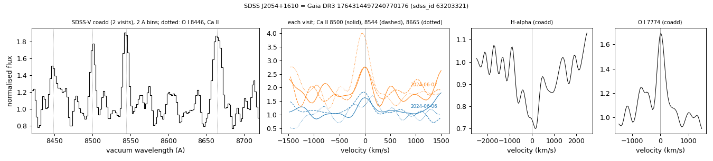

# SDSS J2054+1610 (Gaia DR3 1764314497240770176)

## Ca II triplet emission (gaseous discs)

White dwarf, G = 18.411; catalogued: SnowWhite DA; SIMBAD WD?.

**Measurement.** Ca II triplet emission (single-peaked); EW 24.15 ± 3.17 A in the SDSS-V coadd; other spectra: none found in SPARCL (SDSS, BOSS, DESI) or the ESO archive; gas_disc_epochs_1764314497240770176.csv.

Method and context: [gas_discs](../gas_discs.md)

Tables: [gas_disc_white_dwarfs.csv](../../tables/gas_disc_white_dwarfs.csv), [gas_disc_epochs_1764314497240770176.csv](../../tables/gas_disc_epochs_1764314497240770176.csv). Scripts: `scripts/gas_disc_epochs.py` (commands in the [reproduction list](../../README.md#reproduction)).

## Figures

