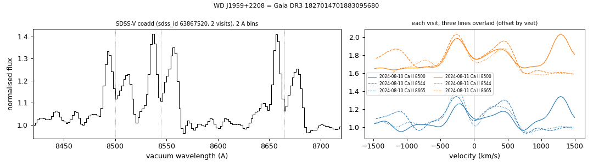

# WD J1959+2208 (Gaia DR3 1827014701883095680)

## Ca II triplet emission (gaseous discs)

White dwarf, G = 16.78; catalogued: SnowWhite DBA/DB; SIMBAD WD*/DB; MWDD DB.

**Measurement.** Ca II triplet emission (double-peaked, peak velocities -260/430 km/s); EW 22.8 ± 0.36 A in the SDSS-V coadd; other spectra: none found in SPARCL (SDSS, BOSS, DESI) or the ESO archive; gas_disc_epochs_1827014701883095680.csv.

Method and context: [gas_discs](../gas_discs.md)

Tables: [gas_disc_white_dwarfs.csv](../../tables/gas_disc_white_dwarfs.csv), [gas_disc_epochs_1827014701883095680.csv](../../tables/gas_disc_epochs_1827014701883095680.csv). Scripts: `scripts/gas_disc_epochs.py` (commands in the [reproduction list](../../README.md#reproduction)).

## Input data

- [data/ztf_1827014701883095680.csv](../../data/ztf_1827014701883095680.csv)

## Figures

