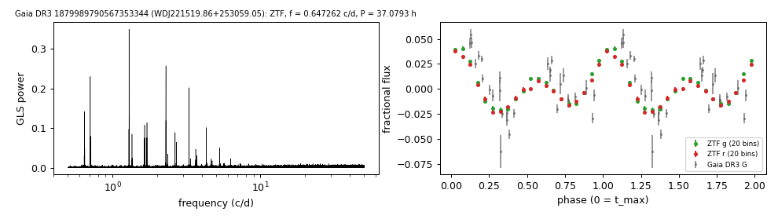

# WDJ221519.86+253059.05 (Gaia DR3 1879989790567353344)

## Day-scale periods of hot white dwarfs

GALEX J221519.8+253059; spectral type DOZ (MWDD). G = 17.05, 1190 pc.

**Measurement.** P = 18.54001 ± 0.00026 h (ZTF, n = 2716, BJD 2458218.987-2460969.789); semi-amplitude 2.2% ± 0.1%.

| data set | n | semi-amplitude | first harmonic |
|---|---|---|---|
| ZTF | 2716 | 2.19% ± 0.06% | 0.14% |
| ZTF zg | 1259 | 2.27% ± 0.07% | 0.17% |
| ZTF zr | 1457 | 2.08% ± 0.09% | 0.15% |
| Gaia DR3 epoch photometry G | 30 | 2.90% ± 0.48% | - |

Method and context: [hot_wd_periods](../hot_wd_periods.md)

Tables: [hot_wd_periods.csv](../../tables/hot_wd_periods.csv). Scripts: `scripts/hot_dae_wd_periods.py` (commands in the [reproduction list](../../README.md#reproduction)).

## Input data

- [data/gaia_dr3_epoch_photometry_1879989790567353344.csv](../../data/gaia_dr3_epoch_photometry_1879989790567353344.csv)
- [data/ztf_1879989790567353344.csv](../../data/ztf_1879989790567353344.csv)

## Figures

