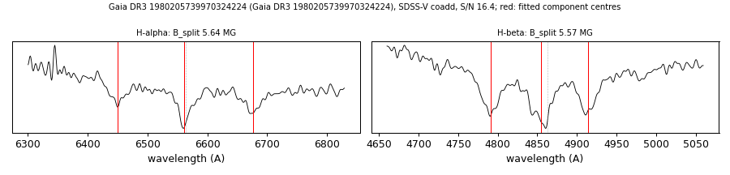

# Gaia DR3 1980205739970324224

## Zeeman splitting

DA white dwarf, G = 17.057; catalogued: SnowWhite DA; SIMBAD WD*/DA; MWDD DA:. Listed as ZZ Ceti (P = 1286 s) in Vincent et al. 2020, AJ 160, 252.

**Measurement.** Zeeman-split Balmer lines: B = 5.64 ± 0.03 MG (H-alpha), 5.57 ± 0.02 MG (H-beta); spectrum S/N 16.4.

Method and context: [zeeman](../zeeman.md)

Tables: [magnetic_zeeman.csv](../../tables/magnetic_zeeman.csv). Scripts: `scripts/zeeman_split.py` (commands in the [reproduction list](../../README.md#reproduction)).

## Figures

