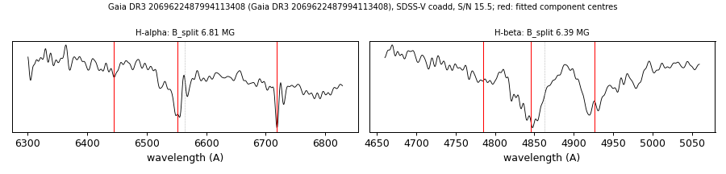

# Gaia DR3 2069622487994113408

## Zeeman splitting

DA white dwarf, G = 17.58; catalogued: SnowWhite DAH/DA; SIMBAD WD*/DA:; MWDD DA:.

**Measurement.** Zeeman-split Balmer lines: B = 6.81 ± 0.03 MG (H-alpha), 6.39 ± 0.08 MG (H-beta); spectrum S/N 15.5.

Method and context: [zeeman](../zeeman.md)

Tables: [magnetic_zeeman.csv](../../tables/magnetic_zeeman.csv). Scripts: `scripts/zeeman_split.py` (commands in the [reproduction list](../../README.md#reproduction)).

## Figures

