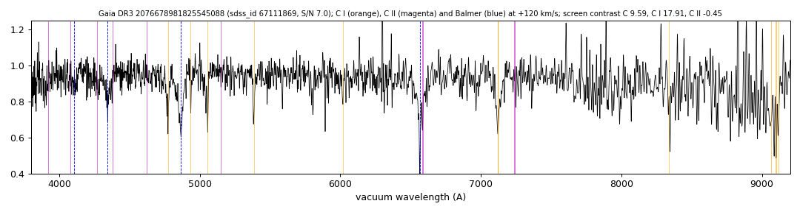

# Gaia DR3 2076678981825545088

## Carbon lines

White dwarf, G = 18.698; catalogued: SIMBAD WD*/DA; MWDD DA.

**Measurement.** Carbon lines in the SDSS-V spectra: CCF contrast C II 3.8, C I 4.6 (velocities -890.0/180.0 km/s).

Method and context: [carbon](../carbon.md)

Tables: [carbon_white_dwarfs.csv](../../tables/carbon_white_dwarfs.csv). Scripts: `scripts/carbon_lines.py` (commands in the [reproduction list](../../README.md#reproduction)).

## Figures

