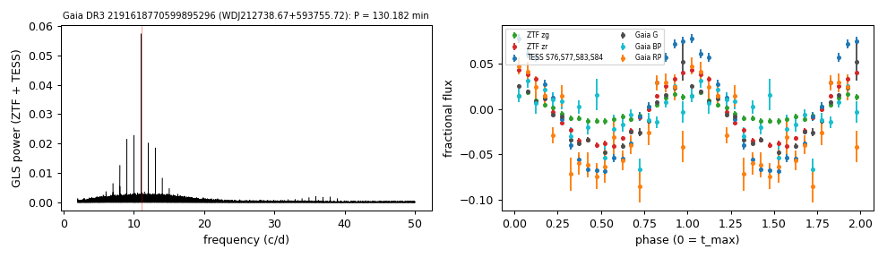

# WDJ212738.67+593755.72 (Gaia DR3 2191618770599895296)

## Short-period white dwarfs with irradiated companions

Low-mass white dwarf: GF21 H-atmosphere Teff 13777 K, 0.263 Msun; G = 16.871, 241 pc.

**Measurement.** P = 130.182 min; red-to-blue (Gaia RP/BP) semi-amplitude ratio 2.6 ± 0.8; W1 3.61x the white-dwarf model (companion M_W1 = 9.28).

Method and context: [irradiated_companions](../irradiated_companions.md)

Tables: [irradiated_companions.csv](../../tables/irradiated_companions.csv), [irradiated_companions_periods.csv](../../tables/irradiated_companions_periods.csv). Scripts: `scripts/irradiated_companions.py` (commands in the [reproduction list](../../README.md#reproduction)).

## Input data

- [data/gaia_dr3_epoch_photometry_2191618770599895296.csv](../../data/gaia_dr3_epoch_photometry_2191618770599895296.csv)
- [data/ztf_2191618770599895296.csv](../../data/ztf_2191618770599895296.csv)

## Figures

