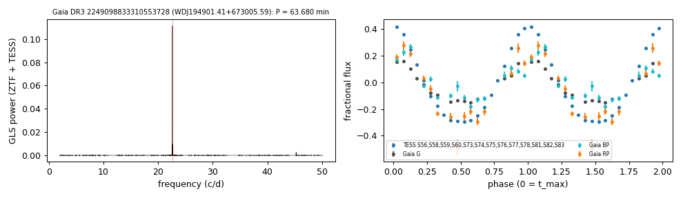

# WDJ194901.41+673005.59 (Gaia DR3 2249098833310553728)

A catalogued but unclassified 63.7-minute variable, identified here as a low-mass white dwarf with an irradiated, near-Roche-filling companion — potentially the shortest-period detached white dwarf + brown dwarf system known (the shortest published period is 68.2 min; Casewell et al. 2018).

## Short-period white dwarfs with irradiated companions

Low-mass white dwarf: GF21 H-atmosphere Teff 16817 K, 0.143 Msun; G = 18.027, 739 pc.

**Measurement.** P = 63.68 min; red-to-blue semi-amplitude ratio 1.61.

Method and context: [irradiated_companions](../irradiated_companions.md)

Tables: [irradiated_companions.csv](../../tables/irradiated_companions.csv), [irradiated_companions_periods.csv](../../tables/irradiated_companions_periods.csv). Scripts: `scripts/irradiated_companions.py` (commands in the [reproduction list](../../README.md#reproduction)).

## Input data

- [data/gaia_dr3_epoch_photometry_2249098833310553728.csv](../../data/gaia_dr3_epoch_photometry_2249098833310553728.csv)

## Figures

