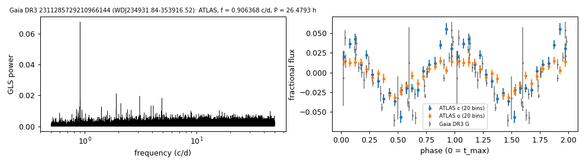

# WDJ234931.84-353916.52 (Gaia DR3 2311285729210966144)

## Day-scale periods of hot white dwarfs

GALEX J234931.8-353916; SDSS-V DR20 SnowWhite class DA. G = 17.88, 882 pc.

**Measurement.** P = 26.4793 ± 0.00036 h (ATLAS, n = 3759, BJD 2457303.886-2461309.748); semi-amplitude 2.6% ± 0.2%.

| data set | n | semi-amplitude | first harmonic |
|---|---|---|---|
| ATLAS | 3759 | 2.63% ± 0.16% | 0.52% |
| Gaia DR3 epoch photometry G | 36 | 3.58% ± 0.33% | - |

Method and context: [hot_wd_periods](../hot_wd_periods.md)

Tables: [hot_wd_periods.csv](../../tables/hot_wd_periods.csv). Scripts: `scripts/hot_dae_wd_periods.py` (commands in the [reproduction list](../../README.md#reproduction)).

## Input data

- [data/atlas_forced_photometry_2311285729210966144.txt](../../data/atlas_forced_photometry_2311285729210966144.txt)
- [data/gaia_dr3_epoch_photometry_2311285729210966144.csv](../../data/gaia_dr3_epoch_photometry_2311285729210966144.csv)

## Figures

