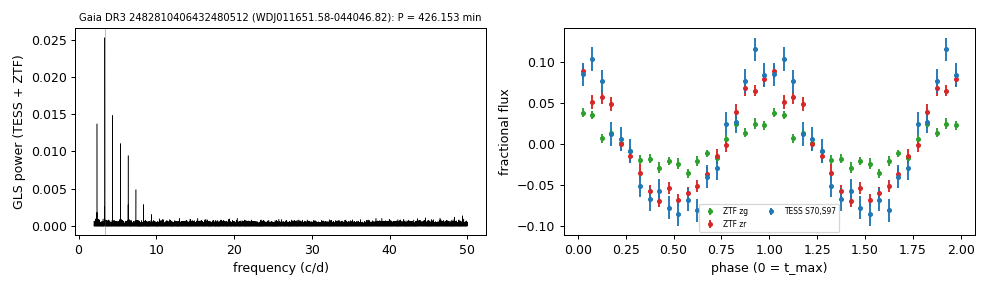

# WDJ011651.58-044046.82 (Gaia DR3 2482810406432480512)

## Short-period white dwarfs with irradiated companions

Low-mass white dwarf: GF21 H-atmosphere Teff 21670 K, 0.23 Msun; G = 18.343, 978 pc.

**Measurement.** P = 426.153 min; red-to-blue (Gaia RP/BP) semi-amplitude ratio 2.49; W1 3.48x the white-dwarf model (companion M_W1 = 8.13).

Method and context: [irradiated_companions](../irradiated_companions.md)

Tables: [irradiated_companions.csv](../../tables/irradiated_companions.csv), [irradiated_companions_periods.csv](../../tables/irradiated_companions_periods.csv). Scripts: `scripts/irradiated_companions.py` (commands in the [reproduction list](../../README.md#reproduction)).

## Input data

- [data/ztf_2482810406432480512.csv](../../data/ztf_2482810406432480512.csv)

## Figures

