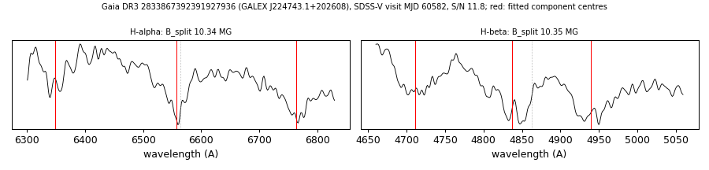

# GALEX J224743.1+202608 (Gaia DR3 2833867392391927936)

## Zeeman splitting

DA white dwarf, G = 17.688; catalogued: SnowWhite DAH/DA; SIMBAD WD*/DA:; MWDD DA:.

**Measurement.** Zeeman-split Balmer lines: B = 10.34 ± 0.05 MG (H-alpha), 10.35 ± 0.11 MG (H-beta); spectrum S/N 11.8.

Method and context: [zeeman](../zeeman.md)

Tables: [magnetic_zeeman.csv](../../tables/magnetic_zeeman.csv). Scripts: `scripts/zeeman_split.py` (commands in the [reproduction list](../../README.md#reproduction)).

## Figures

