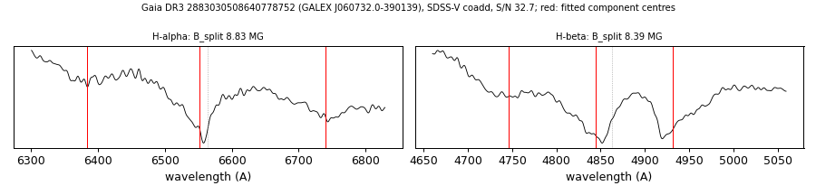

# GALEX J060732.0-390139 (Gaia DR3 2883030508640778752)

## Zeeman splitting

DA white dwarf, G = 17.582; catalogued: SnowWhite DAH; SIMBAD WD*/DA:; MWDD DA:.

**Measurement.** Zeeman-split Balmer lines: B = 8.83 ± 0.05 MG (H-alpha), 8.39 ± 0.3 MG (H-beta); spectrum S/N 32.7.

Method and context: [zeeman](../zeeman.md)

Tables: [magnetic_zeeman.csv](../../tables/magnetic_zeeman.csv). Scripts: `scripts/zeeman_split.py` (commands in the [reproduction list](../../README.md#reproduction)).

## Figures

