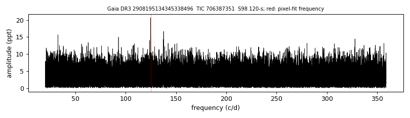

# GALEX J054243.4-261011 (Gaia DR3 2908195134345338496)

## TESS amplitude spectra

White dwarf, G = 17.634; SnowWhite DA (Teff 12173 K, log g 7.93); catalogued: SIMBAD WD*/DA; MWDD DA.

**Measurement.** TESS pulsation signal(s): sector 98: 692.1 s at 20.7 ppt (FAP 9.5e-05); pixel-level test (sector 98): chi2 56.6 at the target vs 78.1 at the best other star (G = 16.81, 28.9 arcsec).

Method and context: [zz_ceti](../zz_ceti.md)

Tables: [zz_ceti_objects.csv](../../tables/zz_ceti_objects.csv), [zz_ceti_tess_sectors.csv](../../tables/zz_ceti_tess_sectors.csv). Scripts: `scripts/tess_periodogram.py`, `scripts/tess_pixel_test.py` (commands in the [reproduction list](../../README.md#reproduction)).

## Figures

