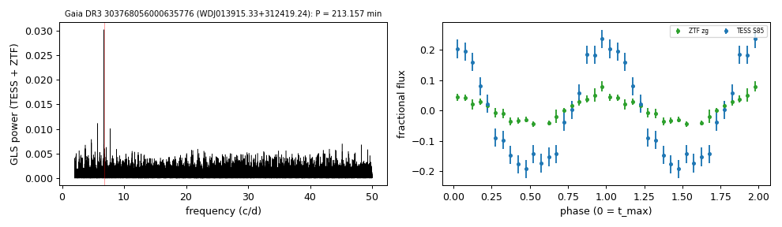

# WDJ013915.33+312419.24 (Gaia DR3 303768056000635776)

## Short-period white dwarfs with irradiated companions

Low-mass white dwarf: GF21 H-atmosphere Teff 21412 K, 0.209 Msun; G = 18.016, 925 pc.

**Measurement.** P = 213.157 min; red-to-blue (Gaia RP/BP) semi-amplitude ratio ; W1 2.12x the white-dwarf model (companion M_W1 = 8.78).

Method and context: [irradiated_companions](../irradiated_companions.md)

Tables: [irradiated_companions.csv](../../tables/irradiated_companions.csv), [irradiated_companions_periods.csv](../../tables/irradiated_companions_periods.csv). Scripts: `scripts/irradiated_companions.py` (commands in the [reproduction list](../../README.md#reproduction)).

## Input data

- [data/ztf_303768056000635776.csv](../../data/ztf_303768056000635776.csv)

## Figures

