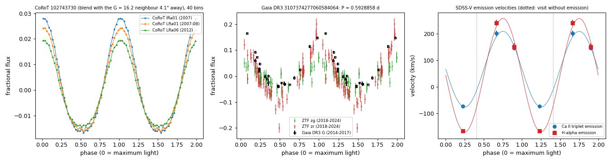
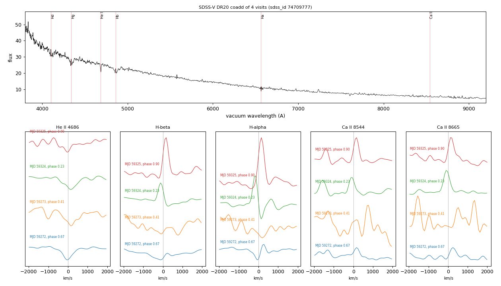

# WDJ064438.09-004550.51 (Gaia DR3 3107374277060584064)

## Photometric periods

Hot white dwarf with He II 4686 absorption (SIMBAD WD* DO:, MWDD DO:, SDSS-V SnowWhite DA:; VSX type WD without a period); H-alpha, H-beta and Ca II emission whose velocity follows the photometric phase.

**Measurement.** P = 0.59288582 d (14.2293 h) in CoRoT (2007-2012), Gaia DR3 epoch photometry and ZTF; semi-amplitude 11.6% (ZTF r), 3.9% (ZTF g), 10.2% (Gaia G); emission velocities +242/-166/+152 km/s (H-alpha) at phases 0.67/0.23/0.90 from maximum light..

Method and context: [periodic](../periodic.md)

Tables: [reflection_3107374277060584064.csv](../../tables/reflection_3107374277060584064.csv), [reflection_3107374277060584064_visits.csv](../../tables/reflection_3107374277060584064_visits.csv). Scripts: `scripts/reflection_3107374277060584064.py` (commands in the [reproduction list](../../README.md#reproduction)).

## Input data

- [data/gaia_dr3_epoch_photometry_3107374277060584064.csv](../../data/gaia_dr3_epoch_photometry_3107374277060584064.csv)
- [data/ztf_3107374277060584064.csv](../../data/ztf_3107374277060584064.csv)

## Figures

