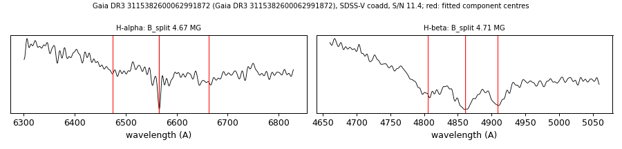

# Gaia DR3 3115382600062991872

## Zeeman splitting

DA white dwarf, G = 18.412; catalogued: SnowWhite DA; SIMBAD WD*/DA; MWDD DA.

**Measurement.** Zeeman-split Balmer lines: B = 4.67 ± 0.09 MG (H-alpha), 4.71 ± 0.04 MG (H-beta); spectrum S/N 11.4.

Method and context: [zeeman](../zeeman.md)

Tables: [magnetic_zeeman.csv](../../tables/magnetic_zeeman.csv). Scripts: `scripts/zeeman_split.py` (commands in the [reproduction list](../../README.md#reproduction)).

## Figures

