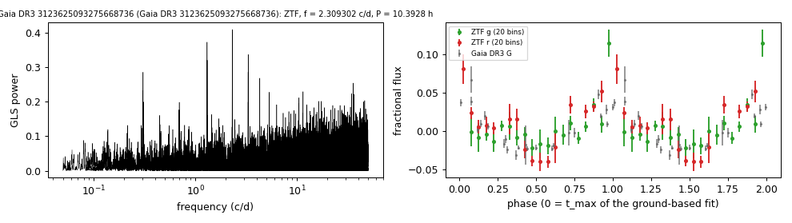

# Gaia DR3 3123625093275668736

## Photometric periods

White dwarf and M dwarf in Rebassa-Mansergas et al. (2025); SDSS-V SnowWhite DA_MS.

**Measurement.** P = 10.39275 ± 0.00013 h (ZTF, n = 126, BJD 2458384.945-2460338.79); semi-amplitude 2.9% ± 0.3%.

| data set | n | semi-amplitude | first harmonic |
|---|---|---|---|
| ZTF | 126 | 2.94% ± 0.32% | 0.88% |
| ZTF zg | 59 | 2.17% ± 0.49% | 0.96% |
| ZTF zr | 67 | 3.37% ± 0.42% | 1.12% |
| Gaia DR3 epoch photometry G | 24 | 2.64% ± 0.28% | - |

Method and context: [periodic](../periodic.md)

Tables: [periodic_white_dwarfs.csv](../../tables/periodic_white_dwarfs.csv). Scripts: `scripts/periodic_white_dwarfs.py` (commands in the [reproduction list](../../README.md#reproduction)).

## Input data

- [data/gaia_dr3_epoch_photometry_3123625093275668736.csv](../../data/gaia_dr3_epoch_photometry_3123625093275668736.csv)
- [data/ztf_3123625093275668736.csv](../../data/ztf_3123625093275668736.csv)

## Figures

