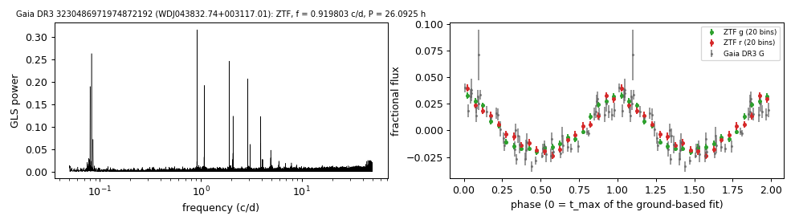

# WDJ043832.74+003117.01 (Gaia DR3 3230486971974872192)

## Photometric periods

DO white dwarf, Teff 105.6 kK, log g 8.0 (Kilic et al. 2026a, via the MWDD). Steen et al. (2024) list it as a likely binary with P = 26.01 h (Gaia) and 26.07 h (ZTF), the same period.

**Measurement.** P = 26.09254 ± 0.00018 h (ZTF, n = 1871, BJD 2458204.653-2460970.008); semi-amplitude 2.6% ± 0.1%.

| data set | n | semi-amplitude | first harmonic |
|---|---|---|---|
| ZTF | 1871 | 2.56% ± 0.09% | 0.47% |
| ZTF zg | 934 | 2.59% ± 0.10% | 0.54% |
| ZTF zr | 937 | 2.52% ± 0.14% | 0.38% |
| Gaia DR3 epoch photometry G | 53 | 2.64% ± 0.17% | - |
| TESS S98 PDCSAP (TIC 672345277, CROWDSAP 0.303) | 23977 | 3.68% ± 0.44% | - |

Method and context: [periodic](../periodic.md)

Tables: [periodic_white_dwarfs.csv](../../tables/periodic_white_dwarfs.csv). Scripts: `scripts/periodic_white_dwarfs.py` (commands in the [reproduction list](../../README.md#reproduction)).

## Input data

- [data/gaia_dr3_epoch_photometry_3230486971974872192.csv](../../data/gaia_dr3_epoch_photometry_3230486971974872192.csv)
- [data/ztf_3230486971974872192.csv](../../data/ztf_3230486971974872192.csv)

## Figures

