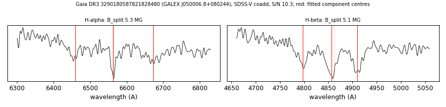

# GALEX J050006.8+080244 (Gaia DR3 3290180587821828480)

## Zeeman splitting

DA white dwarf, G = 18.906; catalogued: SnowWhite DA; SIMBAD WD*/DA; MWDD DA.

**Measurement.** Zeeman-split Balmer lines: B = 5.3 ± 0.09 MG (H-alpha), 5.1 ± 0.04 MG (H-beta); spectrum S/N 10.3.

Method and context: [zeeman](../zeeman.md)

Tables: [magnetic_zeeman.csv](../../tables/magnetic_zeeman.csv). Scripts: `scripts/zeeman_split.py` (commands in the [reproduction list](../../README.md#reproduction)).

## Figures

