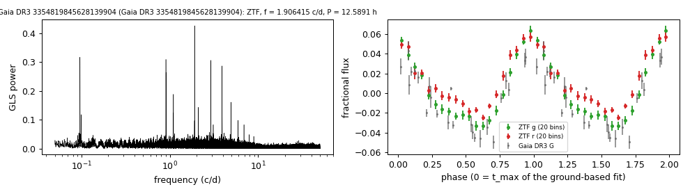

# Gaia DR3 3354819845628139904

## Photometric periods

Hot-subdwarf candidate in Geier et al. (2019).

**Measurement.** P = 12.58907 ± 4e-05 h (ZTF, n = 1350, BJD 2458204.653-2460968.964); semi-amplitude 4.0% ± 0.1%.

| data set | n | semi-amplitude | first harmonic |
|---|---|---|---|
| ZTF | 1350 | 3.98% ± 0.11% | 1.31% |
| ZTF zg | 400 | 4.30% ± 0.16% | 1.46% |
| ZTF zr | 950 | 3.61% ± 0.16% | 1.22% |
| Gaia DR3 epoch photometry G | 24 | 2.19% ± 0.63% | - |

Method and context: [periodic](../periodic.md)

Tables: [periodic_white_dwarfs.csv](../../tables/periodic_white_dwarfs.csv). Scripts: `scripts/periodic_white_dwarfs.py` (commands in the [reproduction list](../../README.md#reproduction)).

## Input data

- [data/gaia_dr3_epoch_photometry_3354819845628139904.csv](../../data/gaia_dr3_epoch_photometry_3354819845628139904.csv)
- [data/ztf_3354819845628139904.csv](../../data/ztf_3354819845628139904.csv)

## Figures

