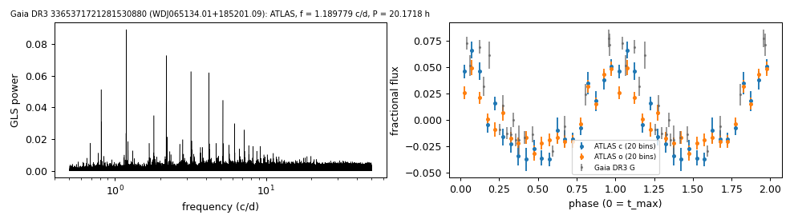

# WDJ065134.01+185201.09 (Gaia DR3 3365371721281530880)

## Day-scale periods of hot white dwarfs

No spectrum found. G = 18.10, 1100 pc.

**Measurement.** P = 20.17182 ± 0.00014 h (ATLAS, n = 3900, BJD 2457314.107-2461308.099); semi-amplitude 3.6% ± 0.2%.

| data set | n | semi-amplitude | first harmonic |
|---|---|---|---|
| ATLAS | 3900 | 3.61% ± 0.18% | 0.85% |
| Gaia DR3 epoch photometry G | 19 | 5.16% ± 0.51% | - |

Method and context: [hot_wd_periods](../hot_wd_periods.md)

Tables: [hot_wd_periods.csv](../../tables/hot_wd_periods.csv). Scripts: `scripts/hot_dae_wd_periods.py` (commands in the [reproduction list](../../README.md#reproduction)).

## Input data

- [data/atlas_forced_photometry_3365371721281530880.txt](../../data/atlas_forced_photometry_3365371721281530880.txt)
- [data/gaia_dr3_epoch_photometry_3365371721281530880.csv](../../data/gaia_dr3_epoch_photometry_3365371721281530880.csv)

## Figures

