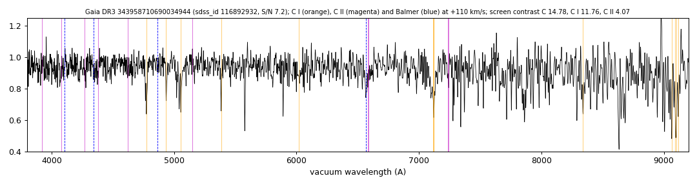

# GALEX J014648.4+400114 (Gaia DR3 343958710690034944)

## Carbon lines

White dwarf, G = 18.645; catalogued: SIMBAD WD*/DB; MWDD DB.

**Measurement.** Carbon lines in the SDSS-V spectra: CCF contrast C II 3.1, C I 5.9 (velocities -2120.0/110.0 km/s).

Method and context: [carbon](../carbon.md)

Tables: [carbon_white_dwarfs.csv](../../tables/carbon_white_dwarfs.csv). Scripts: `scripts/carbon_lines.py` (commands in the [reproduction list](../../README.md#reproduction)).

## Figures

