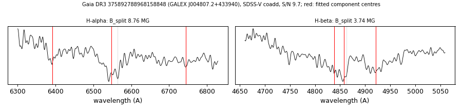

# GALEX J004807.2+433940 (Gaia DR3 375892788968158848)

## Zeeman splitting

DA white dwarf, G = 19.121; catalogued: SnowWhite DAH; SIMBAD WD*/DA:; MWDD DA:.

**Measurement.** Zeeman-split Balmer lines: B = 8.76 ± 0.04 MG (H-alpha), 3.74 ± 0.15 MG (H-beta); spectrum S/N 9.7; the two lines disagree by more than 1 MG, so the field is not established.

Method and context: [zeeman](../zeeman.md)

Tables: [magnetic_zeeman.csv](../../tables/magnetic_zeeman.csv). Scripts: `scripts/zeeman_split.py` (commands in the [reproduction list](../../README.md#reproduction)).

## Figures

