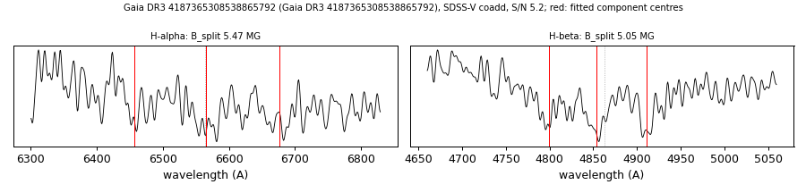

# Gaia DR3 4187365308538865792

## Zeeman splitting

DA white dwarf, G = 19.421; catalogued: SnowWhite DA/DAH; SIMBAD WD*/DA; MWDD DA.

**Measurement.** Zeeman-split Balmer lines: B = 5.47 ± 0.08 MG (H-alpha), 5.05 ± 0.09 MG (H-beta); spectrum S/N 5.2.

Method and context: [zeeman](../zeeman.md)

Tables: [magnetic_zeeman.csv](../../tables/magnetic_zeeman.csv). Scripts: `scripts/zeeman_split.py` (commands in the [reproduction list](../../README.md#reproduction)).

## Figures

