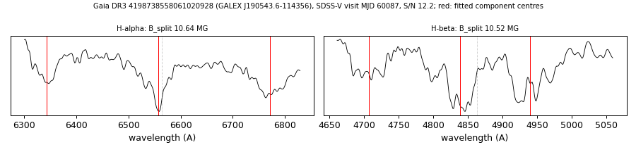

# GALEX J190543.6-114356 (Gaia DR3 4198738558061020928)

## Zeeman splitting

DA white dwarf, G = 17.858; catalogued: SnowWhite DA/DAH; SIMBAD WD*/DA; MWDD DA.

**Measurement.** Zeeman-split Balmer lines: B = 10.64 ± 0.04 MG (H-alpha), 10.52 ± 0.14 MG (H-beta); spectrum S/N 12.2.

Method and context: [zeeman](../zeeman.md)

Tables: [magnetic_zeeman.csv](../../tables/magnetic_zeeman.csv). Scripts: `scripts/zeeman_split.py` (commands in the [reproduction list](../../README.md#reproduction)).

## Figures

