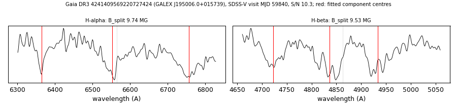

# GALEX J195006.0+015739 (Gaia DR3 4241409569220727424)

## Zeeman splitting

DA white dwarf, G = 18.226; catalogued: SnowWhite DA/DAH; SIMBAD WD*/DA; MWDD DA.

**Measurement.** Zeeman-split Balmer lines: B = 9.74 ± 0.05 MG (H-alpha), 9.53 ± 0.08 MG (H-beta); spectrum S/N 10.3.

Method and context: [zeeman](../zeeman.md)

Tables: [magnetic_zeeman.csv](../../tables/magnetic_zeeman.csv). Scripts: `scripts/zeeman_split.py` (commands in the [reproduction list](../../README.md#reproduction)).

## Figures

