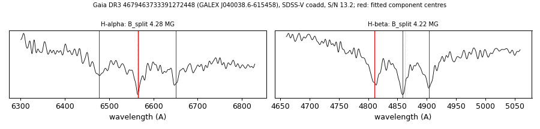

# GALEX J040038.6-615458 (Gaia DR3 4679463733391272448)

## Zeeman splitting

DA white dwarf, G = 18.514; catalogued: SnowWhite DA; SIMBAD WD*/DA; MWDD DA. Common proper motion with Gaia DR3 4679466653969618816 (G 9.83) at 86 arcsec.

**Measurement.** Zeeman-split Balmer lines: B = 4.28 ± 0.03 MG (H-alpha), 4.22 ± 0.02 MG (H-beta); spectrum S/N 13.2.

Method and context: [zeeman](../zeeman.md)

Tables: [magnetic_zeeman.csv](../../tables/magnetic_zeeman.csv). Scripts: `scripts/zeeman_split.py` (commands in the [reproduction list](../../README.md#reproduction)).

## Figures

