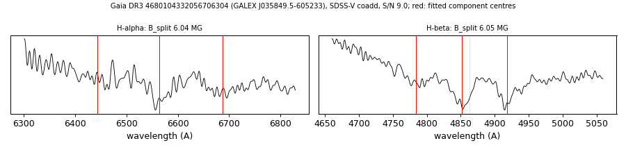

# GALEX J035849.5-605233 (Gaia DR3 4680104332056706304)

## Zeeman splitting

DA white dwarf, G = 18.697; catalogued: SnowWhite DAH/DA; SIMBAD WD*/DA; MWDD DA.

**Measurement.** Zeeman-split Balmer lines: B = 6.04 ± 0.16 MG (H-alpha), 6.05 ± 0.06 MG (H-beta); spectrum S/N 9.0.

Method and context: [zeeman](../zeeman.md)

Tables: [magnetic_zeeman.csv](../../tables/magnetic_zeeman.csv). Scripts: `scripts/zeeman_split.py` (commands in the [reproduction list](../../README.md#reproduction)).

## Figures

