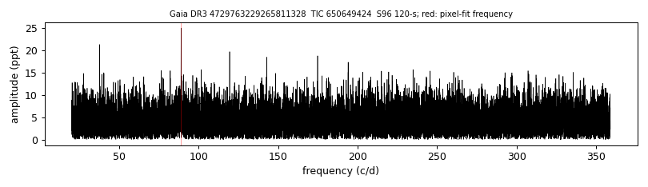

# GALEX J033619.1-564435 (Gaia DR3 4729763229265811328)

## TESS amplitude spectra

White dwarf, G = 17.493; SnowWhite DA (Teff 11626 K, log g 8.07); catalogued: SIMBAD WD*/DA; MWDD DA.

**Measurement.** TESS pulsation signal(s): sector 96: 605.1 s at 24.8 ppt (FAP 0.00087); sector 96: 971.4 s at 25.0 ppt (FAP 6.4e-05); pixel-level test (sector 96): chi2 29.6 at the target vs 38.5 at the best other star (G = 15.26, 9.2 arcsec).

Method and context: [zz_ceti](../zz_ceti.md)

Tables: [zz_ceti_objects.csv](../../tables/zz_ceti_objects.csv), [zz_ceti_tess_sectors.csv](../../tables/zz_ceti_tess_sectors.csv). Scripts: `scripts/tess_periodogram.py`, `scripts/tess_pixel_test.py` (commands in the [reproduction list](../../README.md#reproduction)).

## Figures

