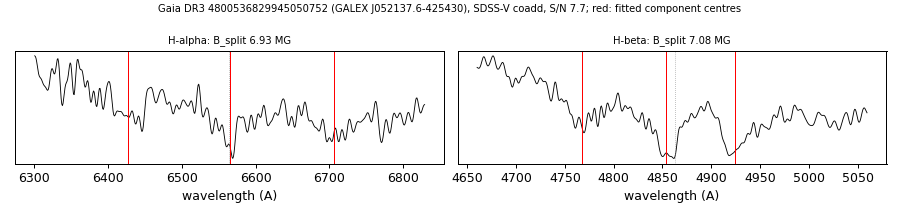

# GALEX J052137.6-425430 (Gaia DR3 4800536829945050752)

## Zeeman splitting

DA white dwarf, G = 19.525; catalogued: SnowWhite DA/DAH; SIMBAD WD?.

**Measurement.** Zeeman-split Balmer lines: B = 6.93 ± 0.07 MG (H-alpha), 7.08 ± 0.05 MG (H-beta); spectrum S/N 7.7.

Method and context: [zeeman](../zeeman.md)

Tables: [magnetic_zeeman.csv](../../tables/magnetic_zeeman.csv). Scripts: `scripts/zeeman_split.py` (commands in the [reproduction list](../../README.md#reproduction)).

## Figures

