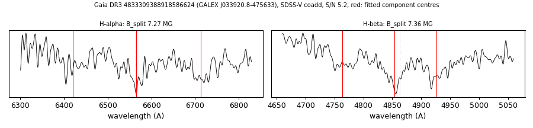

# GALEX J033920.8-475633 (Gaia DR3 4833309388918586624)

## Zeeman splitting

DA white dwarf, G = 19.696; catalogued: SnowWhite DA/DAH; SIMBAD WD?.

**Measurement.** Zeeman-split Balmer lines: B = 7.27 ± 0.08 MG (H-alpha), 7.36 ± 0.09 MG (H-beta); spectrum S/N 5.2.

Method and context: [zeeman](../zeeman.md)

Tables: [magnetic_zeeman.csv](../../tables/magnetic_zeeman.csv). Scripts: `scripts/zeeman_split.py` (commands in the [reproduction list](../../README.md#reproduction)).

## Figures

