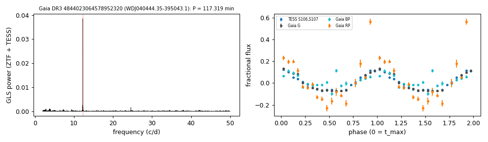

# WDJ040444.35-395043.1 (Gaia DR3 4844023064578952320)

## Short-period white dwarfs with irradiated companions

Low-mass white dwarf: GF21 H-atmosphere Teff 20562 K, 0.243 Msun; G = 17.663, 632 pc.

**Measurement.** P = 117.319 min; red-to-blue semi-amplitude ratio 5.66; W1 2.02x the white-dwarf model (companion M_W1 = 9.33).

Method and context: [irradiated_companions](../irradiated_companions.md)

Tables: [irradiated_companions.csv](../../tables/irradiated_companions.csv), [irradiated_companions_periods.csv](../../tables/irradiated_companions_periods.csv). Scripts: `scripts/irradiated_companions.py` (commands in the [reproduction list](../../README.md#reproduction)).

## Input data

- [data/gaia_dr3_epoch_photometry_4844023064578952320.csv](../../data/gaia_dr3_epoch_photometry_4844023064578952320.csv)

## Figures

