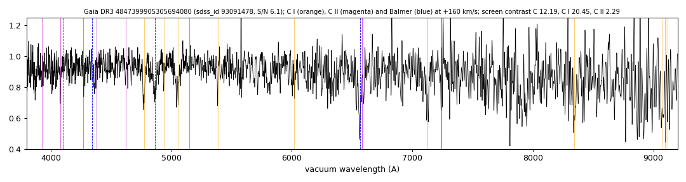

# GALEX J031529.6-443716 (Gaia DR3 4847399905305694080)

## Carbon lines

White dwarf, G = 19.7; catalogued: SIMBAD WD?.

**Measurement.** Carbon lines in the SDSS-V spectra: CCF contrast C II 4.5, C I 11.2 (velocities -60.0/170.0 km/s).

Method and context: [carbon](../carbon.md)

Tables: [carbon_white_dwarfs.csv](../../tables/carbon_white_dwarfs.csv). Scripts: `scripts/carbon_lines.py` (commands in the [reproduction list](../../README.md#reproduction)).

## Figures

