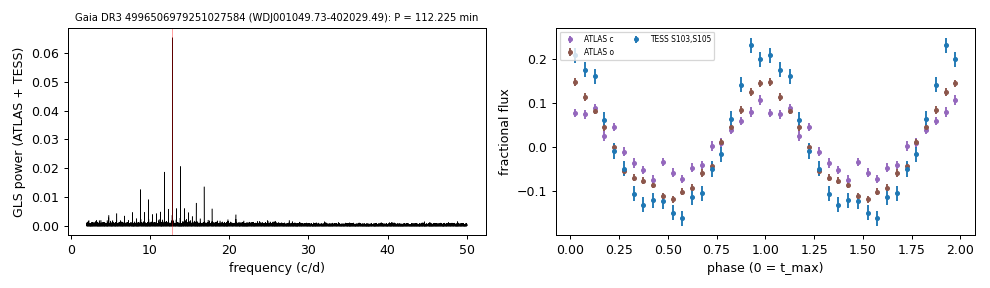

# WDJ001049.73-402029.49 (Gaia DR3 4996506979251027584)

## Short-period white dwarfs with irradiated companions

Low-mass white dwarf: GF21 H-atmosphere Teff 18795 K, 0.247 Msun; G = 18.328, 745 pc.

**Measurement.** P = 112.225 min; red-to-blue (Gaia RP/BP) semi-amplitude ratio 1.61.

Method and context: [irradiated_companions](../irradiated_companions.md)

Tables: [irradiated_companions.csv](../../tables/irradiated_companions.csv), [irradiated_companions_periods.csv](../../tables/irradiated_companions_periods.csv). Scripts: `scripts/irradiated_companions.py` (commands in the [reproduction list](../../README.md#reproduction)).

## Input data

- [data/atlas_forced_photometry_4996506979251027584.txt](../../data/atlas_forced_photometry_4996506979251027584.txt)

## Figures

