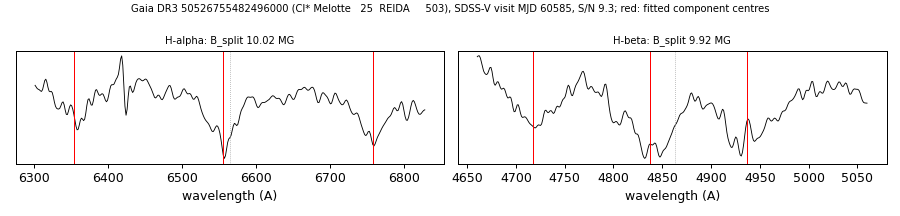

# Cl* Melotte   25  REIDA     503 (Gaia DR3 50526755482496000)

## Zeeman splitting

DA white dwarf, G = 18.333; catalogued: SnowWhite DAH; SIMBAD WD*/DA:; MWDD DA:.

**Measurement.** Zeeman-split Balmer lines: B = 10.02 ± 0.06 MG (H-alpha), 9.92 ± 0.12 MG (H-beta); spectrum S/N 9.3.

Method and context: [zeeman](../zeeman.md)

Tables: [magnetic_zeeman.csv](../../tables/magnetic_zeeman.csv). Scripts: `scripts/zeeman_split.py` (commands in the [reproduction list](../../README.md#reproduction)).

## Figures

